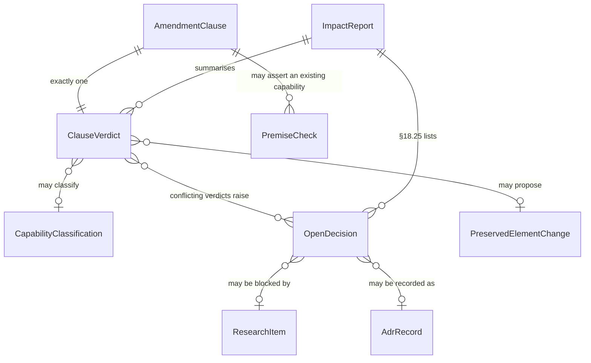

# Data Model: AI-Native Amendment Reconciliation

**Epic**: `EPIC-027` | **Date**: 2026-08-13 | **Plan**: [plan.md](./plan.md)

**Two models, deliberately separated.** Part 1 is what this epic *builds* — the reconciliation
register, which is documents and checks, not tables. Part 2 is what this epic *proposes* — the
platform entity deltas the amendment implies, recorded as classified proposals so that
`FR-AMD-016`'s analysis-only boundary is visible rather than asserted.

Nothing in Part 2 is a migration. No `schema.sql` change is made by this epic.

---

# Part 1 — The reconciliation register (built by EPIC-027)

Storage is the git repository: a markdown table per entity for humans, and a generated JSON
projection the conformance checks read (`R-027-1`). Schema in
[contracts/reconciliation-register.md](./contracts/reconciliation-register.md).

## AmendmentClause

One substantive statement from one of the five documents.

| Field | Type | Rules |
|---|---|---|
| `id` | `CLA-###` | Stable, sequential, never reused |
| `document` | enum | `plan-amendment` · `native-speckit` · `lifecycle` · `defect-management` · `cosmos-learnings` |
| `section` | string | Section number as printed in the source, e.g. `§19` |
| `text` | string | Quoted, not paraphrased — paraphrase is where premises get lost |
| `normativity` | enum | `shall` · `must` · `should` · `may` · `narrative` |
| `duplicates` | `CLA-###[]` | Clauses stating the same thing in another document |

**Why `normativity` is a field and not a judgement made later**: the five documents mix binding
language with recommendation, and the spec's Assumptions already rule that *"advisory clauses are
recorded as principles, not requirements"*. Recording the verb at intake makes that rule mechanical
rather than a per-clause argument.

## ClauseVerdict

Exactly one per clause. `FR-AMD-002`.

| Field | Type | Rules |
|---|---|---|
| `clause` | `CLA-###` | Unique — two verdicts on one clause fails `SC-AMD-001` |
| `verdict` | enum | `already-covered` · `needs-enhancement` · `missing` · `conflicting` · `should-integrate` |
| `owner` | string | Existing requirement/epic ID, **or** the literal `NO-EXISTING-COVERAGE` |
| `reasoning` | string | Non-empty |
| `action` | string | What happens next, or `none` with a reason |
| `new_identifier` | string? | Present only when a new ID was genuinely necessary |
| `necessity` | string? | **Required when `new_identifier` is set** — `FR-AMD-003`, `SC-AMD-003` |

The `owner`/`NO-EXISTING-COVERAGE` pair is deliberate. An empty owner is indistinguishable from an
unfinished row; an explicit sentinel is a claim someone can check.

## CapabilityClassification

`FR-AMD-004`. One per capability, existing or introduced.

| Field | Type | Rules |
|---|---|---|
| `id` | `CAP-###` | |
| `capability` | string | |
| `ownership` | enum | `native` · `integrated` · `hybrid` |
| `reason` | string | Must reference whether PMI Studio must control it to maintain end-to-end workflow (§2's test) |
| `abstraction_boundary` | string? | **Required when `integrated` or `hybrid`** — the named seam, e.g. `CreateImplementationBranch()` |
| `existing_home` | string? | Epic or requirement, where one exists |
| `removed_because_external` | `false` | **Must be false.** §2: existing functionality is not removed solely because an external product provides something similar |

That last field is a constant, and that is the point: it exists so a check can assert it, turning a
prose prohibition into a machine-verifiable one.

## PremiseCheck

`FR-AMD-006`. Verification of every "existing capability" claim.

| Field | Type | Rules |
|---|---|---|
| `id` | `PRE-###` | |
| `claimed_capability` | string | e.g. "the existing Change Room" |
| `claim_source` | `CLA-###` | |
| `search_performed` | string | The actual query, so it is reproducible |
| `occurrence_count` | integer | ≥ 0 |
| `locations` | string[] | Empty when count is 0 |
| `verdict` | enum | `confirmed` · `refuted` · `partial` |

**Finding A is four rows of this table**, and the reason it is a table rather than a paragraph: the
amendment asserts these capabilities exist, the corpus says otherwise, and the difference between
"enhance" and "build" is a programme-sized estimate. A claim of that consequence should carry its
evidence.

## OpenDecision · ResearchItem · AdrRecord

| Entity | Key fields | Governing rule |
|---|---|---|
| **OpenDecision** | `id` (`D-##`), `question`, `options[]` (≥2), `consequence` per option, `owner`, `status`, `blocking_research` | `FR-AMD-008`, `SC-AMD-012` — every conflict is a decision with options, never resolved silently |
| **ResearchItem** | `id` (`R-AI-###` / `R-027-#`), `question`, `blocks[]`, `owner`, `status` | `FR-AMD-014` — a decision dependent on an unanswered item is `blocked`, never `resolved` |
| **AdrRecord** | `subject`, `status` (`decided` \| `open`), `awaits`, `supersedes?`, `superseded_reasoning?` | `FR-AMD-013` — an ADR whose decision is not takeable is recorded **open**, naming what it awaits |

`AdrRecord.supersedes` requires `superseded_reasoning`. Native §27 permits superseding an existing
ADR only *"with documented reasoning"*, and `ADR-0002` is the live case (`D-36`).

## PreservedElementChange

`FR-AMD-015`. One row per proposed change to any of Native §28's sixteen preserved elements.

Five fields, all required: `reason`, `affected_requirement`, `migration_impact`,
`compatibility_impact`, `alternative_considered`. §28 names all five; a row missing any of them fails
its check.

**Expected occupants at time of writing**: the `ContainerRuntime` widening (`D-21`), the egress
policy extension (`D-28`), and the `TraceabilityLink` edge-type expansion — which EPIC-011 `T077a`
will fail on and EPIC-022 `T302` already exists to fix. That last one is worth noting because it is
*scheduled breakage*, not discovered breakage.

## ImpactReport

The §18 deliverable. `sections[25]`, each with `title`, `content`, and `explicitly_empty: boolean`.

A section with nothing to report sets `explicitly_empty` and still carries a reason — `FR-AMD-009`.
The check counts 25 sections and asserts zero placeholders; the flag is what distinguishes "nothing
to report, and here is why" from "not written yet".

## Register relationships



---

# Part 2 — Proposed platform entity deltas (NOT built by this epic)

Every entity below is a **proposal carrying a classification**. `FR-AMD-016` forbids this epic
implementing any of them; recording them is how the impact report's §18.4–§18.10 sections get
written without a second analysis pass.

Posture column: ▶ proceeds (engine lane, no BRS dependency) · ⏸ held (`PMI-DOC-004`).

## Agent layer — `D-20`

| Entity | Verdict | Key attributes | Posture |
|---|---|---|---|
| **AgentDescriptor** | MISSING | provider · model · execution type · capabilities · context limits · tool capabilities · MCP support · repository capabilities · cost metadata · security classification · interactive/unattended | ▶ |
| **AgentRegistration** | MISSING | Mirrors the built `EngineRegistration` exactly — same shape, same registry semantics | ▶ |
| **AgentExecutionRequest** | MISSING | project · workspace · epic · task · role · requested capabilities · context scope · permissions · execution policy · timeout · resource limits · provider preference (Native §2) | ▶ |
| **AgentRun** | ENHANCE of `GenerationJob` | provider · model · agent version · execution id · triggering artifact · correlation id · timestamps · status · token/cost metadata · policy decisions · resulting artifacts (Native §7) | ⏸ (EPIC-012) |

**`AgentRun` is the entity that carries `C-24`.** Its ten states include `waiting_for_input` and
`waiting_for_approval`, which is why `D-25` places the state machine in the database rather than the
queue. Note the requirement embedded in Native §7: *"Never log prompts/output containing sensitive
project information through unrestricted operational logs"* — which is `PC-3`'s existing exclusion,
already asserted by `T157`, extended to a new entity. That is a preserved control, not a new one.

## Execution layer — `D-21`, `D-22`

| Entity | Verdict | Notes | Posture |
|---|---|---|---|
| **ProjectExecutionEnvironment** | ENHANCE of `ContainerRuntime` | Lifecycle (`ephemeral` \| `persistent`), provider, capability descriptor, egress profile, credential scope | ▶ **urgent — `T646`** |
| **PersistentProjectState** | MISSING | Repository ref · `.specify/` state · project config · toolchain config. **Durable substrate is `D-22`** | ▶ |
| **EgressProfile** | ENHANCE of the fixed allow-list | `name` · `allowed_destinations[]` · `enforcement` | ▶ **`ADR-0002` extension, `D-28`/`D-36`** |
| **ScopedCredential** | MISSING | purpose · scope · TTL · minted-per-run. **Never a long-lived secret in a sandbox** | ▶ |

**The invariant that must survive**: Native §5 — *"No sandbox state may implicitly become
authoritative project state."* Adding `PersistentProjectState` is precisely the change most likely to
erode it, because the two now look alike from inside a container. The boundary needs to be a
mechanism, not a convention.

## Governance intake — all ⏸ held

| Entity | Verdict | Source |
|---|---|---|
| **RequirementRecord** + 12-state machine | MISSING | lifecycle §2 — `Captured → AI Analyzed → Clarification Required → Stakeholder Review → Approved → Baseline → Specified → Planned → Implementing → Verified → Released`, plus `Rejected · Deferred · Superseded · Withdrawn` |
| **RequirementBaseline** | MISSING | lifecycle §4 — `BL-###` |
| **Decision** + **DecisionEvidencePackage** | MISSING | lifecycle §3, §8 — question · context · options · assumptions · evidence · constraints · risk · trade-off · AI recommendation · confidence · model version · comments · final decision · decision maker · timestamp · superseded decisions |
| **ChangeRequest** + **ChangeImpactAnalysis** + **ChangeRiskScore** | MISSING | lifecycle §5, §6, §12 — risk score drives approval routing (0–25 → PO; 81–100 → PO+PM+Architect+Security) |
| **DefectReport** + **DefectTriage** + **TddRemediationQueueEntry** | MISSING | defect §1–§11 — triage classes: `confirmed-defect · change-request · requirement-gap · duplicate · cannot-reproduce · environmental · invalid` |
| **RootCauseCluster** | MISSING | defect §9 — needs similarity, hence `D-24` |
| **EvidencePackage** + **CompletionGate** | MISSING | Plan Amendment §11 |
| **ContextScope** + **AccessSnapshot** | ENHANCE | Native §11 — *"compatible with the existing `generation_jobs` access_snapshot concept"*. **The seam already exists**, built for EPIC-002/024 |

**Two observations worth carrying into the impact report.**

First, `DecisionEvidencePackage` is the entity that makes **PP-016 Explainable AI** concrete. The
spec already records this as a strengthening rather than a new obligation, and the data model shows
why: PP-016 currently rests on storing raw engine output verbatim (`R-007`), which explains *what* an
AI produced but never *why a decision went the way it did*. This entity is the missing half.

Second, `AccessSnapshot` is a genuine reuse, not a coincidence. `generation_jobs.access_snapshot`
exists because EPIC-024 needed run-start access capture (`T381`, `FR-028`). Native §11's ContextScope
wants the same thing for the same reason. **That is `FR-AMD-003` working as intended** — a new
identifier is not created where an existing concept covers the clause.

## Knowledge graph — ENHANCE, ⏸ held

`TraceabilityLink` exists with **two** edge types. The amendment names roughly eighteen node types
across Plan Amendment §10, Native §23 and lifecycle §11:

```text
Business Goal · Requirement · Requirement Version · Decision · Specification ·
Specification Version · Architecture Decision · Plan · Epic · Feature · Task ·
Agent Run · Defect · Change Request · Test · Commit · Pull Request · Build ·
Deployment · Verification · Incident · Security Evidence
```

Native §23 adds a constraint the current model does not carry: *"Do not assume all relationships are
strictly hierarchical. Model traceability as typed relationships capable of traversal in both
directions."* The built model is already row-based and indexed both ways
(`system-design.md`: *"Traceability as rows, not as a view — indexed in both directions"*), so the
shape is right. **What changes is the enumeration**, and `T077a` will fail the moment it widens —
scheduled, with `T302` already written to update it.

**Open**: whether recursive PostgreSQL traversal still meets latency at this node-type count and
corpus size (`R-027-4`). Measurement, not opinion, decides whether a graph store ever enters the
stack.

---

## What this data model deliberately omits

| Omitted | Why |
|---|---|
| Physical DDL for any Part 2 entity | `FR-AMD-016` — this epic writes no schema |
| Field-level detail for the three Rooms | Held behind `PMI-DOC-004`; the BRS is precisely the document that settles requirement-approval behaviour |
| MCP tool schemas | Native §10: *"exact tools must be specified during design"* — M-09's work |
| Embedding dimensions, index type, model choice | Depends on `D-24` and `R-027-5`; guessing produces a migration nobody can justify |
| Identifier form for new entities | **`D-1` is still open.** Choosing `FR-xxxx` vs `FR-SPEC-001` here would pre-empt a decision five documents are already arguing about |
