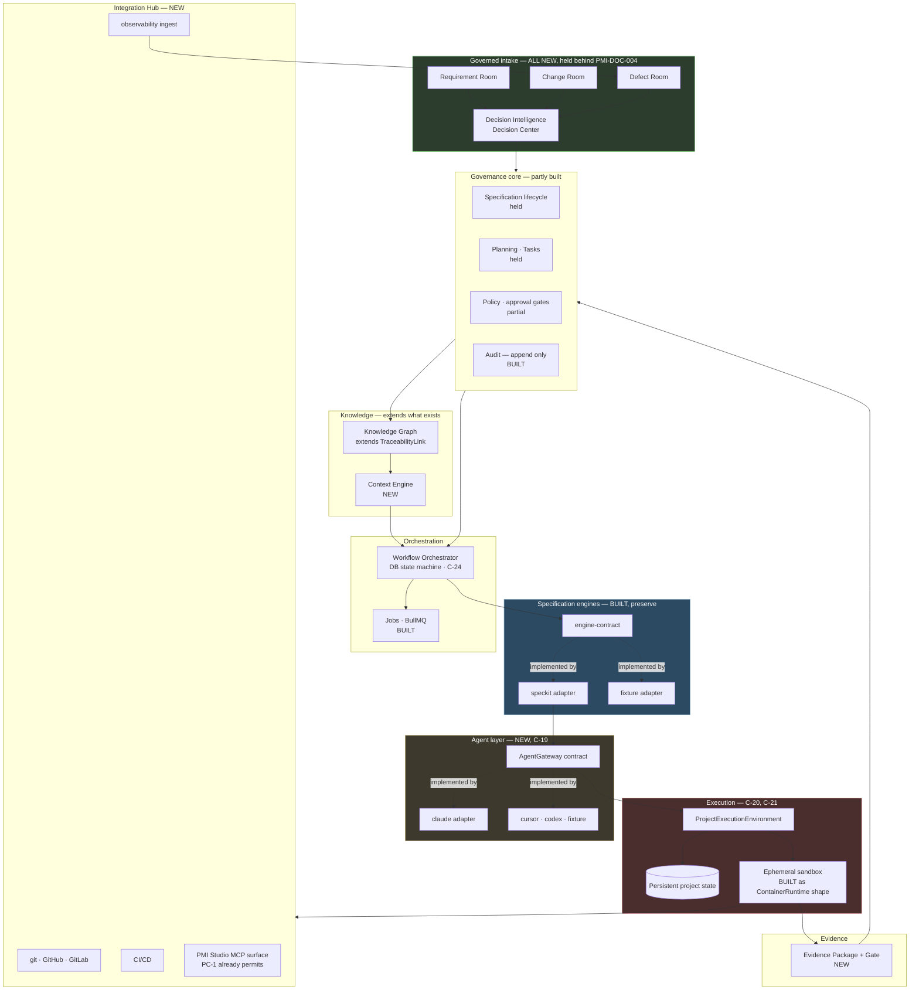

# Implementation Plan: AI-Native Amendment Reconciliation

**Epic**: `EPIC-027` | **Module**: programme reconciliation (no product module) | **Date**: 2026-08-13 |
**Spec**: [spec.md](./spec.md)

**Posture**: ▶ **PROCEEDING** — analysis of held work is not held work.

**Companion artifacts**: [research.md](./research.md) · [data-model.md](./data-model.md) ·
[contracts/](./contracts/) · [quickstart.md](./quickstart.md)

**Rulings that shaped this plan**: **D-10** (proceed/hold split), **D-12** (authority layered by
subject), **D-16** (authority layered by artifact population), **D-15/D-18/D-19** (epics sit below
modules). All in [srs-alignment.md](../srs-alignment.md).

---

## Summary

The project owner asked for a reassessment of **solution, architecture, system design and
technology** against the four amendment documents, and for the questions to be gathered rather than
dripped out one at a time.

This plan does that. It is not a build plan — `FR-AMD-016` bounds EPIC-027 to analysis — but it is
also not a plan to *write a plan*. The reassessment itself is the deliverable, because §17 makes it
the precondition for every implementation task the amendment implies.

**The headline finding is not in the documents. It is in the code.**

> The amendment's central architectural demand — separate the *specification engine* from the *AI
> agent* (Native §3) — is already violated in the built tree, and the violation is invisible because
> the test that would catch it does not exist. `engine-adapters/speckit/src/speckit.adapter.ts`
> hardcodes `claude` as a command name in four places and takes a single opaque `aiProviderToken`.
> Today that is *legal*: the architecture test guards `backend/**` against engine references, and an
> adapter is permitted to be engine-specific. But it means **swapping the AI provider and swapping
> the specification engine are the same edit**, which is precisely the merge Native §3 forbids.

Three further findings compound it, all verified against the repository rather than asserted:

- The `ContainerRuntime` port exists with **no production implementation** (`T447`), and `T447` is
  the *next task the programme was about to do* (EPIC-003 closure report, 2026-08-08). Implementing
  it as a Docker driver — the obvious reading — creates exactly the coupling Native §4 forbids.
  **This is the single most time-critical item in the amendment.**
- The sandbox egress allow-list is *"AI provider endpoint only"*, asserted by test and recorded in
  `ADR-0002`. Native §19 explicitly instructs re-evaluating it. This is the amendment's only direct
  conflict with a **built and tested security control**.
- The current design deliberately destroys the workspace after every job and never commits it.
  Native §5 requires persistent project state alongside ephemeral execution. That is not an
  enhancement of the existing sandbox; it is a second storage tier that does not exist.

Everything else the amendment introduces — Integration Hub, Context Engine, Knowledge Graph,
Evidence Packages, the three Rooms — is **product surface**, and therefore lands behind the
`PMI-DOC-004` hold that already holds nineteen epics. That is the honest answer to the scope-creep
question: the amendment's *immediately actionable* surface is small, architectural, and sits inside
the lane that is already proceeding.

> **Planning session outcome, 2026-08-13.** Twenty-two decisions were raised and **twelve were taken
> in session** — including all three that gate the next task in the programme. The largest is
> `D-31`: **PMI Studio is multi-tenant SaaS first**, which the corpus had deliberately never decided
> and which the amendment's §1 positioning forces. Its consequences propagate through credentials,
> egress, tenancy and cost, and are recorded rather than left to be rediscovered. Nine decisions
> remain open; each has a recommendation and none blocks Band 1.

---

## Technical Context

**Language/Version**: none for this epic's own outputs. The reassessment reasons about the existing
TypeScript 5.x / Node 22 LTS platform; conformance checks are written in the repository's existing
Vitest toolchain.

**Primary Dependencies**: none new *for EPIC-027*. Four candidate additions are evaluated below for
later epics. Two were **adopted in session** — an execution-substrate driver behind the PEE port
(`D-21`) and a credential broker (`D-27`, `D-41`). Two remain **recommended, not adopted**:
`pgvector` (`D-24`) and the model-routing layer beneath the agent gateway (`D-30`). None is
installed by this epic.

**Storage**: the git repository. The reconciliation register is a versioned markdown + machine-
readable pair (see [contracts/reconciliation-register.md](./contracts/reconciliation-register.md)).

**Testing**: executable conformance checks under `tests/governance/`, alongside the 159 checks
EPIC-018 already runs. Constitution V (v1.2.0) covers document outputs through exactly this
mechanism; there is no exemption to argue.

**Target Platform**: the repository and its specification corpus. No runtime, no deployment.

**Project Type**: programme reconciliation / architecture analysis.

**Performance Goals**: not applicable to this epic. The reassessment *sets* two thresholds for
later work — knowledge-graph traversal and context assembly — and both are recorded as open
(`R-027-4`, `R-027-6`).

**Constraints**:
- `FR-AMD-016` — analysis only. No product capability, no in-place rewriting of existing specs.
- `FR-AMD-001` — additive. Native §28's sixteen preserved elements are the floor.
- **PP-002 Single Source of Truth** is the failure mode most likely here: the amendment restates
  capabilities that already exist under other names. Every classification must resolve to one owner.

**Scale/Scope**: 4 source documents · ~340 substantive clauses · 26 existing epic specifications ·
461 tracked tasks · 5 ADRs (12 more required by Native §27) · 14 named research items · 20 open
decisions raised below.

**NEEDS CLARIFICATION**: none blocking Phase 0. The amendment is unusually prescriptive; where a
normal plan would guess, this one quotes. The 27 open decisions below are **stakeholder decisions**,
not specification gaps — they are the §18.25 deliverable, not a failure to specify.

---

## Constitution Check

*GATE: Must pass before Phase 0 research. Re-check after Phase 1 design.*

| # | Gate | Status |
|---|------|--------|
| I | All changes produced only via Spec Kit commands — no direct edits | **PASS** — outputs land under `specs/027-*/`, which is exempt. No application code is touched by this epic; the code findings below are *observations*, and every correction they imply is routed to a named task in another epic |
| II | Every requirement traces to a cited `SRS/` document | **PASS** — 16 traceability rows in [spec.md](./spec.md); zero untraced requirements. This epic is fully SRS-traced, which is unusual in the corpus |
| III | Work decomposed Epic → Feature → Task; Epic ID assigned; directory exists | **PASS** — `EPIC-027`, 7 functions defined below |
| IV | `/speckit-converge` scheduled as the Epic exit gate | **PASS** — Phase Z will be generated by `/speckit-tasks` |
| V | Every task carries a unit test, or for document outputs an executable conformance check that can fail | **PASS** — every function below names its check. Ratified programme-wide in constitution **v1.2.0**; no reading to argue |
| VI | `specs/027-ai-native-amendment/defects/` exists and is the sole defect intake | **PASS** — exists, empty |
| VII | Changes land in local first; promotion local → dev → stage → prod | **PASS** — trivially; this epic ships no runtime artifact |
| VIII | Session labelled with the working Epic | ⚠️ **DEVIATION** — the working branch is `epic/003-specification-engine`, not an EPIC-027 branch. Same lapse recorded in the EPIC-003 closure report; `G-08` passes because it checks branch-name *format*, not correspondence. Recorded, not hidden — see Complexity Tracking |
| IX | Run closes with Work Completed + Recommended Next Task | **PASS** |
| — | Repository synced from GitHub before work started | ⚠️ **NOT VERIFIED** — not checked this session. Stated rather than claimed |
| — | No other Claude session active on this checkout | **PASS** — asserted by the operator, not independently verifiable |
| — | **PMI-DOC-003 register** — deltas recorded per D-6 | **PASS** — 6 deltas in [spec.md](./spec.md); no principle weakened by the amendment |
| — | **D-10 honoured** — held work stays held | **PASS** — `FR-AMD-017`. The amendment is not the BRS; the hold is untouched |
| — | **D-13 not pre-empted** — the deferred 18-module re-cut is recorded, not resolved | **PASS** — `D-23` below records the dependency |

**One deviation (VIII), no FAIL.** Phase 0 proceeds.

**Post-design re-check (after Phase 1)**: **PASS, and gate V is strengthened.** The register
contract turns `SC-AMD-001` through `SC-AMD-012` from review items into machine-readable assertions
— a clause with no verdict, a verdict with no owner, or a capability with no classification each
fail a check. That is the difference between a reconciliation that is *claimed* complete and one
that is *proven* complete, and it is what stops this epic becoming the 25-section document nobody
audits.

---

# Part A — Architecture reassessment

## A.1 What exists, stated precisely

Only the engine lane is built. Verified by inspection, not by reading `tasks.md`:

| Component | State | Evidence |
|---|---|---|
| `packages/engine-contract` | ✅ built | `SpecificationEngine`: generate · generateTasks · validate |
| `engine-adapters/speckit` | ✅ built, **cannot run** | Logic complete and conformant; `ContainerRuntime` has no implementation (`T447`) |
| `engine-adapters/fixture` | ✅ built | Second engine proving contract neutrality |
| `backend/src/modules` | audit · engines · jobs **only** | No projects, requirements, specifications, traceability — all held |
| `worker/src` | ✅ built | `engine-composition.ts` (composition root), `generation.consumer.ts` |
| Architecture tests | 2 of 3 | `engine-independence.spec.ts`, `transport-independence.spec.ts`. **No agent-independence test exists** |
| Prisma | ❌ not a dependency yet | EPIC-004 `T013`. `EngineRegistration` verified by text assertion only |
| Product surface | ⏸ held | 19 epics pending `PMI-DOC-004` |

**The platform cannot currently run a real generation.** That is not a criticism — it is the state
the amendment lands on, and it changes which corrections are cheap.

## A.2 The amendment's target, mapped onto it

```text
  AMENDMENT TARGET                     TODAY                        VERDICT
─────────────────────────────────────────────────────────────────────────────────────
  Requirement / Change / Defect Rooms  ✗ zero occurrences           MISSING (build, not enhance)
  Decision Intelligence Engine         ✗ absent                     MISSING
  Engineering Context Engine           ✗ absent                     MISSING
  Knowledge Graph                      ◐ TraceabilityLink, 2 edges  ENHANCE  (EPIC-011/022)
  Evidence Package / Evidence Gate     ✗ absent                     MISSING
  Engineering Integration Hub          ✗ absent                     MISSING
  AI Agent Gateway                     ✗ absent — provider hardcoded CONFLICT (see A.3)
  ProjectExecutionEnvironment          ◐ ContainerRuntime port only  ENHANCE, urgently (A.4)
  Persistent project state             ✗ workspace destroyed by design MISSING (A.5)
  EgressPolicy abstraction             ◐ fixed allow-list, tested    CONFLICT (A.6)
  Spec Kit native to the workflow      ◐ CLI in a disposable sandbox ENHANCE (A.7)
  Source-of-truth boundaries           ◐ implicit, undocumented      CONFLICT (A.7)
  ExecutionJob / AgentRun, 10 states   ◐ GenerationJob, fewer states ENHANCE (A.8)
  MCP surface                          ✗ deferred to M-09 Phase 3    PHASE CONFLICT (A.9)
  Human / AI responsibility split      ◐ PP-003, no mechanism        ENHANCE
  SpecificationEngine contract         ✅ built                      PRESERVE (Native §28)
  Engine independence enforcement      ✅ build-time                  PRESERVE, and **replicate for agents**
```

## A.3 · **C-19 — Engine independence is enforced; agent independence is not** 🔴 CRITICAL

The amendment's most-repeated architectural rule (Native §2, §3; Plan Amendment §6) is that PMI
Studio must not depend on a single AI provider. The repository enforces the *analogous* rule for
engines with real teeth — and has no equivalent for agents.

**Evidence, from the tree:**

| Location | Content |
|---|---|
| `speckit.adapter.ts:133,144,172` | `'claude'` passed to `specify init --integration` |
| `speckit.adapter.ts:178` | `['claude', '-p', '/speckit-tasks']` |
| `speckit.adapter.ts:201` | `['claude', '-p', '/speckit-analyze']` |
| `speckit.adapter.ts:83` | `aiProviderToken: string` — one credential, one provider, no selection |
| `backend/tests/architecture/` | `engine-independence`, `transport-independence`. **No `agent-independence`** |

**Why this is a conflict and not merely a gap.** Under today's rules this code is compliant: the
adapter is allowed to be Spec-Kit-specific, and `backend/**` is clean. But the amendment adds a
second independence axis, and on that axis the *engine adapter is also the agent adapter*. Native §3
states the separation as a prohibition — *"Do NOT merge SpecificationEngine and AgentExecutor"* —
and gives the configurations that must become possible: `SpecKitEngine → Cursor`,
`NativePMIEngine → Claude`. Neither is expressible today without editing `speckit.adapter.ts`.

**The correction is cheap now and expensive later**, for the same reason ADR-0001 was worth taking
early: the adapter is one file, has 65 tests, and no product surface depends on it.

**Recommended correction** — three moves, all additive:

1. Introduce `packages/agent-contract` with an `AgentGateway` port (drafted in
   [contracts/agent-gateway.md](./contracts/agent-gateway.md)).
2. Inject the agent into `SpecKitEngine` rather than naming it — the same composition-root pattern
   the worker already uses for engines. `--integration <agent.specKitIntegrationName>`.
3. Add `backend/tests/architecture/agent-independence.spec.ts`, the third test in the family, so the
   rule fails a build rather than relying on discipline. **This is the mechanism ADR-0001 proved
   works, applied to the axis the amendment cares about.**

**Cost**: one new package, one adapter refactor, ~3 tasks plus checks. **Owner decision `D-20`.**

## A.4 · **C-20 — `T447` is about to hard-code the execution substrate** 🔴 CRITICAL, time-sensitive

`ContainerRuntime` (`speckit.adapter.ts:66`) is `start(...)` / `stop(...)` with a workspace path, a
timeout and an abort signal. It has **no implementation**. The EPIC-003 closure report names `T447`
— write the production `ContainerRuntime` — as the single recommended next task, and it is right
that it is the last unexecuted claim in "Spec Kit is Engine V1".

Native §4 says: *"PMI Studio business logic must not depend directly on Docker … Define a
ProjectExecutionEnvironment abstraction capable of supporting persistent VM, persistent development
container, ephemeral container, Kubernetes workload, cloud development environment, future execution
providers."* It also says *"Docker remains the Phase 1 execution provider."*

**Both are satisfiable at once, but only if `T447` is written as a `ProjectExecutionEnvironment`
driver rather than as a Docker runtime.** The port is small and already correctly shaped; what it
lacks is the vocabulary the amendment needs — lifecycle (ephemeral vs persistent), an egress policy,
credential scoping, and a capability descriptor.

**If `T447` lands first as plain Docker, this becomes a refactor of the one component nobody can
test without Docker.** That is the argument for deciding now.

**Recommended correction**: widen the port to `ProjectExecutionEnvironment` (drafted in
[contracts/project-execution-environment.md](./contracts/project-execution-environment.md)) and
implement `T447` against it with a Docker provider. Docker stays Phase 1; the seam is present from
the first implementation instead of retrofitted. **Cost: roughly +1 task over the plain
implementation.** **Owner decision `D-21` — the most urgent in this document.**

## A.5 · **C-21 — Persistent project state has no home**

Today's design is emphatic in the other direction, and for good reasons that still hold:

> *"Workspace never committed to any repository … One container per job, destroyed after … No state
> leaks between jobs or tenants."* — `_shared/system-design.md`

Native §5 requires **both**: durable engineering state (git repo, `.specify/`, `specs/`, agent and
build configuration) *and* ephemeral sandboxes that are created, used, and destroyed. §5 also states
the invariant that keeps them safe: *"No sandbox state may implicitly become authoritative project
state."*

This is **additive, not contradictory** — the ephemeral tier is preserved exactly as built; a
persistent tier is added beneath it. But it is genuinely new storage with genuinely new questions:
where does the persistent project live (a git remote? a volume? a cloud workspace?), who can reach
it, and how is it reconciled when two runs touch it. **Owner decision `D-22`; research `R-AI-007`,
`R-AI-010`.**

## A.6 · **C-22 — The egress allow-list conflicts with implementation agents** 🟠 HIGH

| Source | Position |
|---|---|
| `ADR-0002`, `system-design.md`, sandbox tests | Egress allow-list: **AI provider endpoint only** — *"Agent cannot reach the platform, the database, or the internet"* |
| Native §19 | *"Re-evaluate the existing 'AI provider endpoint only' egress policy because future implementation agents may require controlled access to approved MCP servers, package registries, repository endpoints, Context7/documentation services"* — and then, immediately: *"Do NOT simply open general internet access."* |

The current policy is correct **for generation** — a spec-writing agent needs nothing but the model.
It is impossible **for implementation** — an agent that cannot reach npm cannot run a build, and one
that cannot reach the repository cannot open a pull request.

**Recommended correction**: an `EgressPolicy` abstraction with **named profiles per execution
purpose**, not one widened list. `generation` keeps today's policy unchanged and its test unchanged;
`implementation` is a new, explicitly enumerated profile. This preserves ADR-0002 for the case it
was written for and extends rather than supersedes it — which is what Native §27 asks for.
**Owner decision `D-28`; research `R-AI-009`.**

## A.7 · **C-23 — Two sources of truth, structurally**

The deepest design question in the amendment, and it is easy to miss because both halves look
reasonable in isolation.

Today: a specification lives in PostgreSQL (`specifications` + `specification_versions`, raw and
parsed, append-only). Spec Kit markdown is produced inside a sandbox and **destroyed**. There is
exactly one authority.

Under the amendment: Spec Kit becomes native (§8), the project holds a persistent `specs/` tree
(§4), and agents read and write it. The same specification now exists as a database row **and** as a
tracked markdown file that git versions independently. Native §6 names the hazard in its own words:
*"Avoid two uncontrolled sources of truth between PostgreSQL and repository Markdown."*

§22 proposes the boundary — Postgres authoritative for governance state, git for implementation
history, Spec Kit files as *"engine-compatible representations"*, agent workspace and AI conversation
**not** authoritative — and then says *"Identify synchronization and conflict-resolution rules."*
Those rules do not exist, and they are not derivable from the documents.

**This is the one place where getting it wrong is unrecoverable**, because both stores accumulate
history that later has to be reconciled. **Owner decision `D-29`; research `R-AI-006`, `R-027-2`.**

## A.8 · **C-24 — Human-approval states do not belong in a job queue**

Native §20 asks whether `GenerationJob` should become `ExecutionJob`/`AgentRun` and lists ten states
— including `waiting_for_input` and `waiting_for_approval`.

BullMQ is the right tool for the other eight. It is the wrong tool for those two: a job that is
"running" for three days while a product owner is on leave holds a worker slot, defeats timeout
semantics, and makes the `timed_out` state meaningless. Native §20 anticipates the trap — *"Do not
add states without defining transition ownership and recovery semantics."*

**Recommended shape**: keep BullMQ for compute and make the run's lifecycle a **database-owned state
machine** that the queue serves. A run *suspends* — its queue job completes, its persisted state
becomes `waiting_for_approval`, and the approval event enqueues a fresh job to resume. Timeouts then
apply per compute segment, which is the only place they mean anything.

This preserves Native §28's BullMQ commitment while making the human-gate states honest. The
alternative — a durable-workflow engine such as Temporal — is a much larger change and is recorded
as the rejected option with its trigger. **Owner decision `D-25`; research `R-027-3`.**

## A.9 · **C-25 — MCP moves from marketplace to core agent enablement**

`C-07` was resolved by deferral: MCP is a *presentation layer* over existing services, deferred to
catalog module **M-09 MCP Marketplace**, Phase 3. The deferral was accepted **on condition** that
adding MCP later would not be a redesign — which is why `PC-1` exists and is tested.

The amendment changes what MCP is *for*. In Native §10 and §11, MCP is how an agent reaches governed
context under least privilege — `getRequirement`, `getAllowedContext`, `submitTestEvidence`,
`reportDefect`. That is not a marketplace feature. It is the agent's access path, and an agent
without it falls back to the thing §9 forbids: depending only on repository source code.

**`PC-1` was the right bet and it holds** — the services are transport-independent and the
architecture test proves it. What changes is *phase*, not design. **Owner decision `D-26`.**

---

# Part B — Technology reassessment

## B.1 The stack, re-examined against the amendment

Native §28 preserves sixteen elements. I re-tested each against the amendment's demands rather than
accepting the preservation clause at face value, because a preserved element that cannot carry the
new load is a worse outcome than an argued replacement.

| Element | Amendment load | Verdict |
|---|---|---|
| TypeScript 5.x / Node 22 | Agent contract, PEE contract — both compile-time interfaces | ✅ **Strengthened.** The reason TS was chosen (contracts that fail to compile) applies twice more |
| NestJS | DI composition root for a second adapter family | ✅ **Holds.** Agent adapters register exactly as engine adapters do |
| PostgreSQL 16 | Knowledge graph, evidence, decisions, 12-state machines | ⚠️ **Holds with a threshold** — see B.2 |
| Prisma | More entities, more migrations | ⚠️ **Holds, but is not yet installed** (`T013`). Every new entity below is currently unvalidated |
| BullMQ + Redis/Valkey | Agent runs, human-gate states | ⚠️ **Holds for compute; must not own human gates** — C-24 |
| React 18 | Decision Center, three Rooms, Kanban | ✅ Holds. No component library still chosen (awaits SRS Volume 8) |
| Docker | One of six execution substrates | ⚠️ **Holds as a provider; must stop being the abstraction** — C-20 |
| SpecificationEngine contract | Unchanged | ✅ **Preserve verbatim.** Native §3 protects it |
| Engine adapters + fixture | Pattern replicated for agents | ✅ **The template.** Its fixture adapter is why the conformance suite found three real defects |
| Worker composition root | Second adapter family injected here | ✅ Holds |
| Append-only audit | Evidence packages, decision history | ✅ **Exactly right.** Native §11 and lifecycle §8 both want immutability |
| Traceability model | 2 edge types → ~18 node types, bidirectional | ⚠️ **Extends** — EPIC-011 `T077a` asserts the two-type enumeration and will fail; EPIC-022 `T302` already exists to update it. **Scheduled, not discovered** |
| Architecture dependency tests | Third axis needed | ⚠️ **Extend** — C-19 |
| OpenTelemetry | Agent runs, correlation into sandboxes | ✅ Holds. PC-3's asymmetry (telemetry recorded *by the worker*, not the container) becomes more valuable, not less |
| Workspace identity | Tenancy above workspace already added by EPIC-019 F-17.1 | ✅ Holds |
| Asynchronous generation | Generalises to agent runs | ✅ Holds |

**No preserved element requires replacement.** Three require extension, and one (Docker) requires
demotion from *abstraction* to *provider*. That is a genuinely good outcome and worth stating: the
2026-08-02 stack decisions have survived a significant strategic amendment intact.

## B.2 Four technology decisions the amendment forces

These are not in the existing corpus. Each is recommended, none is adopted.

### B.2.1 Semantic search — `pgvector` 🟢 recommended

Three amendment capabilities require similarity, not exact match:

| Capability | Source |
|---|---|
| *"Find duplicate/overlapping requirements"* | lifecycle §1 |
| *"DEF-431 appears 94% similar to DEF-389"*; root-cause clustering | defect §9 |
| *"task-specific context rather than indiscriminately sending all available information to an LLM"* | Plan Amendment §9 |

Nothing in the stack does this. **`pgvector` is the minimal answer**: a PostgreSQL extension, no new
service, no new operational surface, and it keeps embeddings inside the same transactional store as
the governance state they describe — which matters because a stale embedding of a retired
requirement is a governance defect, not a cache miss.

**Rejected**: a dedicated vector database (Pinecone, Weaviate, Qdrant) — better at scale, but adds a
service and a consistency boundary to a product explicitly targeted at organisations *without*
platform teams (§1). Revisit if corpus size makes recall unacceptable; trigger recorded in
`R-027-5`. **Decision `D-24`.**

### B.2.2 Execution substrate — Docker now, behind `ProjectExecutionEnvironment` 🟢 recommended

Options assessed: Docker · Kubernetes Jobs · Firecracker/gVisor · cloud dev environments
(Codespaces, Coder, Daytona) · agent-sandbox services (E2B, Modal).

**Recommendation: keep Docker as the Phase 1 provider — Native §4 says so explicitly — and spend the
effort on the abstraction instead.** The substrate choice is genuinely reversible once the port
exists, and irreversible-in-practice if it does not. This is C-20 restated as a technology decision.

Worth noting under the amendment's own §2 test: an agent-sandbox service is *commodity execution*,
and buying it would be consistent with the principle. It is rejected for Phase 1 only because the
isolation contract (`ADR-0002`) is already built and tested, not because building it is right.
**Decision `D-21`.**

### B.2.3 Secrets and credential delegation 🟠 gap, no incumbent

The current position — *"Secrets management is an environment concern, not a Phase 1 requirement"* —
does not survive the amendment. Native §8 requires organisation-managed credentials, BYOK, provider
API credentials and enterprise gateways; §19 requires *scoped* repository credentials inside an
untrusted sandbox; §11 forbids the agent receiving organisation secrets at all.

Today the sandbox receives exactly one secret (`aiProviderToken`) and holds no repository
credential, because it never pushes. The moment an agent opens a pull request, that changes.

**This is the largest new security surface in the amendment** and it has no incumbent technology.
Options: cloud KMS/secret manager · HashiCorp Vault · short-lived tokens minted per run (GitHub App
installation tokens are the model). **Recommendation: per-run minted, purpose-scoped, short-lived
credentials — never long-lived secrets mounted into a sandbox** — with the broker abstracted so the
backing store is an operational choice. **Decision `D-27`; research `R-AI-011`.**

### B.2.4 AI Gateway — build or integrate? 🔵 the reflexive question

The amendment's own principle (§2) says: *own the workflow, governance, orchestration, traceability,
context and evidence; integrate commodity execution where mature external tools exist.*

Applied to itself, that principle asks an uncomfortable question. A multi-provider LLM gateway —
routing, failover, capability negotiation, cost metadata — is **not** PMI Studio's differentiator.
Mature options exist (LiteLLM, OpenRouter, Portkey, Bedrock, Vertex). By the amendment's own test,
the *gateway* is arguably commodity while the *orchestrator above it* is native.

But Native §7 wants agent descriptors carrying MCP support, repository capabilities, security
classification and interactive/unattended support — properties no LLM gateway models, because they
describe **coding agents**, not models. Claude Code, Cursor and Codex are not interchangeable model
endpoints.

**Recommendation: split the layer.** `AgentGateway` (agent-level: capability negotiation, execution,
evidence) is **native** — nothing off the shelf models it. Model-level routing beneath it is
**integrable**, and the contract should not prevent an adapter from delegating to LiteLLM or
Bedrock. This is the amendment's §2 classification applied honestly rather than defensively.
**Decision `D-30`.**

## B.3 · **C-26 — Positioning implies a hosting decision the corpus refuses to make** 🟠 HIGH

`_shared/system-design.md` records, deliberately: *"Hosting substrate — containers imply nothing
about where they run. No Phase 1 requirement depends on it."* That was true and well-judged.

Plan Amendment §1 changes it. The target market is *"small and medium software companies, startups,
agencies … organizations without dedicated internal developer-platform teams"*, and §15 promises
*"the engineering capabilities of a sophisticated internal developer platform without having to
design, integrate, secure and maintain one themselves."*

An organisation without a platform team cannot operate a Postgres cluster, a Redis, a worker fleet
and a Docker sandbox host. **The positioning implies multi-tenant SaaS**, and that decision changes
credential architecture (§8 BYOK), egress policy (§19), tenancy enforcement, and the cost model
(PP-017, RAID R-02) — all four of which are otherwise being decided in this same pass.

The corpus does not decide it, and it is not derivable from the amendment. **Decision `D-31` — the
most consequential business-architecture question raised by this reconciliation.**

---

# Part C — System design: the target seams

## C.1 Target architecture, with today's boundaries marked



**Read the colours as cost.** Blue is built and preserved. Amber is the one new contract that must
land early because the built code already violates it. Red is the execution seam whose next task is
imminent. Green is everything held behind the BRS — and it is most of the amendment.

## C.2 The four dependency rules, extended

The existing rule set gains three lines. They are the whole of C-19 and C-20 expressed as something
a build can fail on:

```text
backend    ──►  packages/engine-contract         ✅   (existing)
backend    ──►  engine-adapters/*                ❌   (existing, tested)
worker     ──►  engine-adapters/*                ✅   composition root only (existing)
service    ──►  HTTP types                       ❌   PC-1 (existing, tested)

engine adapter ──►  agent-contract               ✅   NEW — engines request an agent
engine adapter ──►  a named provider             ❌   NEW — no 'claude' string outside an agent adapter
any component  ──►  a container runtime directly ❌   NEW — only via ProjectExecutionEnvironment
```

Each of the three new rules is one assertion in `agent-independence.spec.ts`. That file is the
smallest artifact in this plan and the one that does the most work, because it converts the
amendment's most repeated instruction from prose into a build failure.

## C.3 What this epic does **not** design

Stated so nobody assumes oversight:

- **The three Rooms' internal design.** Held behind the BRS, and the BRS is exactly the document
  that should settle requirement-approval behaviour.
- **The Knowledge Graph's physical schema.** EPIC-011/EPIC-022 own the link model; this epic records
  the node-type expansion as a classification and a threshold, not a migration.
- **The MCP tool list.** Native §10 lists 19 candidates and says *"exact tools must be specified
  during design"*. That is M-09's work.
- **Model selection and cost optimisation.** Still deferred to M-07 (PP-017). RAID **R-02** must be
  re-scored — autonomous multi-agent execution raises the exposure materially, and this is the
  second epic to say so (EPIC-017 said it first).

---

# Part D — Programme shape

## D.1 Where the amendment's capability areas land

`FR-AMD-012` requires each area to be assigned. This is the preview; the register is the deliverable.

| Capability area | Verdict | Home | Posture |
|---|---|---|---|
| Agent Gateway + agent contract | MISSING, urgent | **New epic — EPIC-028 (proposed)** | ▶ proceeds — engine lane |
| ProjectExecutionEnvironment | ENHANCE, urgent | **EPIC-003 re-entry** via `T447` | ▶ proceeds |
| EgressPolicy profiles | CONFLICT | **EPIC-003 re-entry**, `ADR-0002` extension | ▶ proceeds |
| Persistent project state | MISSING | **New epic — EPIC-029 (proposed)** | ▶ proceeds (no product surface) |
| Agent-independence architecture test | MISSING | **EPIC-003 re-entry** | ▶ proceeds |
| Execution job → AgentRun state machine | ENHANCE | **EPIC-012 Workflow & Tasks** | ⏸ held |
| Requirement Room / Requirement Intelligence | MISSING | **New epic** — *not* EPIC-007 (Finding B) | ⏸ held |
| Change Room / Change Intelligence | MISSING | New epic | ⏸ held |
| Defect Room / TDD remediation | MISSING | New epic | ⏸ held |
| Decision Intelligence / Decision Center | MISSING | New epic — shared by all three Rooms | ⏸ held |
| Engineering Context Engine | MISSING | New epic | ⏸ held |
| Knowledge Graph expansion | ENHANCE | **EPIC-011 + EPIC-022** (already exists) | ⏸ held |
| Evidence Package + Gate | MISSING | New epic, or EPIC-015 QA extension | ⏸ held |
| Integration Hub | MISSING | New epic — M-16 API & Integration | ⏸ held |
| PMI Studio MCP surface | Phase conflict | **M-09**, phase decision `D-26` | ⏸ held |
| Spec Kit native lifecycle | ENHANCE | EPIC-008 / EPIC-013 | ⏸ held |
| Human/AI responsibility model | ENHANCE | Cross-cutting → `_shared/platform-spec.md` | ▶ recordable now |

**Four proceed. Thirteen are held.** That is the scope-creep answer in one table: the amendment adds
roughly four epics of *immediately buildable* architectural work and a long, sequenced queue behind
a gate that already exists.

## D.2 Sequencing — §17.11's three bands

**Band 1 — immediate architectural corrections** (proceeding lane, no BRS dependency).
**All three gating decisions were taken on 2026-08-13, so this band is now buildable:**

```text
✅ D-20  agent-contract package + fixture agent   ──┐
✅ D-21  PEE port widened                          ─┼─► T447 against PEE, Docker provider
✅ D-28  EgressPolicy profiles (generation frozen)  ─┘        │
                                                             └─► agent-independence.spec.ts
                                                                     └─► T448 Spec Kit as default
                                                                             └─► FIRST REAL RUN
```

That last line matters: it is the first time in the programme's history that a real container starts
and a real specification is generated. Everything in Band 1 is on the critical path to it.

**Band 2 — near-term, unblocked by the BRS**: persistent project state (`D-22` — a git reference plus
a cache policy, not a storage tier); BYOK credential intake (`D-41`); the agent-facing MCP context
surface (`D-26`) and its least-privilege model (`R-AI-014`); the Human/AI responsibility register.
The AgentRun state machine (`D-25`) and the Knowledge Graph node-type expansion sit here by nature
but land in **held** epics — EPIC-012 and EPIC-011/022 respectively.

**Band 3 — later platform capability**: the three Rooms, Decision Intelligence, Context Engine,
Evidence Gate, Integration Hub, MCP surface. All behind `PMI-DOC-004`.

## D.3 EPIC-027's own functions

| Function | Delivers | Conformance check |
|---|---|---|
| F-27.1 Clause register | Every substantive clause, one verdict, named owner | Every clause row has exactly one verdict and a non-empty owner |
| F-27.2 Premise checks | Search evidence for each "existing capability" claim | Every premise row carries a count and locations |
| F-27.3 Capability classification | native / integrated / hybrid + reason + boundary | Zero unclassified; every *integrated* row names a boundary |
| F-27.4 §18 impact report | All 25 sections, no placeholders | Section count = 25; zero TODO/TBD markers |
| F-27.5 ADR register | 12 subjects from Native §27 | Each subject has a record; each open one names what it awaits |
| F-27.6 Research register | `R-AI-001`–`014` + `R-027-*` | Each item names what it blocks |
| F-27.7 Decision register | Open decisions with options and consequences | Every decision has ≥2 options, a consequence, and an owner |

Seven functions. `/speckit-tasks` will size them; the checks above are what Constitution V requires
and are already drafted in [quickstart.md](./quickstart.md).

---

## Complexity Tracking

| Violation | Why needed | Simpler alternative rejected because |
|---|---|---|
| **Constitution VIII deviation** — work performed on `epic/003-specification-engine` | The branch was already checked out; branching mid-analysis would fragment an untracked epic across two branches | Branching first is genuinely simpler and should have happened. Recorded as a lapse, not justified. It is the third occurrence; `G-08` cannot catch it because it checks name *format*, not correspondence — a check that compares branch to working epic is worth adding to EPIC-018 |
| **A second adapter family** (`agent-contract` alongside `engine-contract`) | Native §3 forbids merging them, and A.3 shows the merge already exists in the tree | One combined contract is simpler and is what exists today. It makes `SpecKitEngine → Cursor` inexpressible, which is the exact configuration §3 names as required |
| **EPIC-027 produces no product capability** | §17 makes reconciliation the precondition for new implementation tasks | Going straight to implementation epics. Rejected because Finding A shows the amendment's own premises are partly false — three "existing" Rooms do not exist. Planning against a false premise mis-sizes the programme |

---

## Phase 0 / Phase 1 outputs

| Artifact | Status | Contents |
|---|---|---|
| [research.md](./research.md) | ✅ written | `R-AI-001`–`014` registered with what each blocks; 8 new `R-027-*` items; 5 answerable now and answered |
| [data-model.md](./data-model.md) | ✅ written | Reconciliation register entities; proposed platform entity deltas as *proposals* |
| [contracts/agent-gateway.md](./contracts/agent-gateway.md) | ✅ drafted | Provider-neutral agent contract — target design, not built |
| [contracts/project-execution-environment.md](./contracts/project-execution-environment.md) | ✅ drafted | PEE port widening `ContainerRuntime` |
| [contracts/reconciliation-register.md](./contracts/reconciliation-register.md) | ✅ written | The machine-readable register schema the conformance checks read |
| [quickstart.md](./quickstart.md) | ✅ written | 12 executable validation scenarios |

---

## Open decisions — the consolidated register

Twenty-two raised, grouped by what they gate. `D-20` onward continues `srs-alignment.md`'s
numbering; `C-19` onward continues its conflict numbering. **None can be resolved by reading the
SRS.**

**Status after the planning session of 2026-08-13: 12 decided, 9 open, 1 subsumed.** Every decided
row is struck through with its outcome; consequences are recorded in the section that follows the
register. Two decisions were *created* by other decisions — `D-40` and `D-41` — which is why the
count grew.

**Verified 2026-08-13**: the premise search behind `D-32` was re-run for this plan, excluding
EPIC-027's own spec. All nine terms — Change Room, Defect Room, Requirement Room, Decision Room,
Agent Gateway, Integration Hub, Context Engine, Evidence Package, change request — return **zero**
across the other 26 epic specifications. Finding A holds.

### Gate 1 — blocks the next task in the programme

| # | Decision | Why now | Outcome |
|---|---|---|---|
| ~~**D-21**~~ | ~~Is `T447` a Docker runtime, or a `ProjectExecutionEnvironment` with a Docker provider?~~ | `T447` is the next recommended task; deciding after it lands means refactoring the one component that cannot be tested without Docker | ✅ **DECIDED 2026-08-13 — PEE with a Docker provider.** `ContainerRuntime` widens per [contracts/project-execution-environment.md](./contracts/project-execution-environment.md); Docker registers at the worker composition root. Docker remains the Phase 1 provider per Native §4 |
| ~~**D-20**~~ | ~~Introduce `packages/agent-contract` + `agent-independence.spec.ts` now, or defer?~~ | The violation exists today and is invisible; the adapter is one file with 65 tests and no dependants | ✅ **DECIDED 2026-08-13 — now.** Contract, architecture test and fixture agent land together; `SpecKitEngine` takes an injected agent instead of naming `claude`. `C-19` closes on delivery |
| ~~**D-28**~~ | ~~Per-purpose `EgressPolicy` profiles, or one allow-list?~~ | Implementation agents cannot run a build under the current policy; `ADR-0002` is built and tested | ✅ **DECIDED 2026-08-13 — named profiles, proxy-enforced.** `generation` unchanged including its test; `implementation` explicitly enumerated. `ADR-0002` extended, not superseded (`D-36` follows) |

### Gate 2 — architecture, decidable now

| # | Decision | Recommendation |
|---|---|---|
| ~~**D-22**~~ | ~~Where does persistent project state live?~~ | ✅ **DECIDED 2026-08-13 — the git remote is the durable substrate.** Volumes are cache only and always reconstructible |
| ~~**D-25**~~ | ~~Do human-approval states live in BullMQ or a database state machine?~~ | ✅ **DECIDED 2026-08-13 — database machine; the queue serves compute segments.** A run suspends by *completing* its queue job. Temporal recorded as the rejected alternative with its trigger |
| ~~**D-27**~~ | ~~Credential model for agents that push code~~ | ✅ **DECIDED 2026-08-13 — per-run minted, purpose-scoped, short-lived.** No long-lived secret ever enters a sandbox; broker abstracted. BYOK was not bundled here and was taken separately as `D-41` |
| ~~**D-29**~~ | ~~Source-of-truth rule between PostgreSQL and repository markdown~~ | ✅ **DECIDED 2026-08-13 — Postgres authoritative; markdown is a one-way projection.** An agent editing markdown produces a proposal, never a fact |
| **D-30** | Is the AI Gateway native or integrated? | Split: agent layer native, model routing integrable |
| **D-24** | Adopt `pgvector` for similarity? | Yes, when the first similarity requirement is planned — not before |

### Gate 3 — programme shape

| # | Decision | Recommendation |
|---|---|---|
| ~~**D-31**~~ | ~~Is PMI Studio SaaS-hosted, self-hosted, or both?~~ | ✅ **DECIDED 2026-08-13 — multi-tenant SaaS first.** Consequences below |
| ~~**D-32**~~ | ~~Are the three Rooms new capability or enhancements? (Finding A)~~ | ✅ **DECIDED 2026-08-13 — new capability.** Sized as builds. `D-33` (EPIC-007) deliberately left separate and still open |
| ~~**D-33**~~ | ~~Does the Requirement Intelligence Engine belong to EPIC-007, or a new epic? (Finding B)~~ | ✅ **DECIDED 2026-08-13 — new epic.** EPIC-007 keeps `EPIC-007`, its name, and its current register-only scope. No renumbering, no mid-programme re-scope. The collision is documented so it cannot be rediscovered as a surprise |
| ~~**D-26**~~ | ~~Does MCP move from M-09 Phase 3 to core agent enablement?~~ | ✅ **DECIDED 2026-08-13 — split.** The agent-facing least-privilege context surface joins core agent enablement; discovery, third-party servers and the marketplace stay at M-09 Phase 3. `C-25` closes; `C-07`'s deferral is *narrowed*, not reversed |
| **D-23** | Does the amendment trigger the deferred 18-module re-cut (`D-13`)? | No. Record the dependency; re-cut once, folding in `D-1` and `D-9` |
| **D-34** | Does the amendment release any part of the `PMI-DOC-004` hold? | **No.** The amendment is architecture and positioning, not a BRS |
| **D-40** | Does **self-hosted** remain a supported deployment, or is it out of scope for now? *(created by `D-31`)* | Out of scope for now, but keep the credential broker and egress enforcement abstracted so it stays reachable. Deciding "SaaS only, forever" would let real coupling in |

### Gate 4 — governance and record-keeping

| # | Decision | Recommendation |
|---|---|---|
| **D-35** | Are the twelve Native §27 ADRs created now as open records, or when each is decided? | Now, as open records naming what each awaits — §26 forbids answering by assumption |
| **D-36** | Does `ADR-0002` get extended or superseded by the egress change? | Extended. Native §27: *"Preserve existing ADRs unless explicitly superseded with documented reasoning"* |
| **D-37** | Does the Human/AI responsibility model become a platform-wide register in `_shared/`? | Yes — it is cross-cutting and belongs where the principle register already lives |
| ~~**D-38**~~ | ~~Is RAID **R-02** (AI cost) re-scored now?~~ | ✅ **Subsumed by `D-41`.** Re-scored, and mitigated structurally rather than by caps alone |
| ~~**D-41**~~ | ~~SaaS + no BYOK leaves model spend unbounded on PMI Studio's account~~ | ✅ **DECIDED 2026-08-13 — BYOK becomes a near-term requirement.** Tenant-owned AI provider keys; repository access stays per-run minted (`D-27`). Removes the exposure structurally |
| **D-39** | Should EPIC-018 gain a check comparing branch name to working epic? | Yes — the Constitution VIII lapse has now occurred three times and `G-08` structurally cannot catch it |

---

## Decisions taken 2026-08-13, and what they change

Four decided in the planning session. Each is recorded here with its consequences, because three of
them change other open decisions rather than merely closing themselves.

### D-21 · `T447` becomes a `ProjectExecutionEnvironment` with a Docker provider ✅

**Closes `C-20`.** The port widens per
[contracts/project-execution-environment.md](./contracts/project-execution-environment.md); Docker
registers at the worker composition root exactly as engine adapters already do. Docker remains the
Phase 1 provider, which is what Native §4 asks for.

**Consequences**:
- `T447`'s scope grows by roughly one task. It is no longer "write a Docker driver" but "widen the
  port, then write a Docker provider behind it".
- The new dependency rule — *no component reaches a container runtime directly* — becomes assertable,
  and belongs in the same architecture test as `D-20`'s.
- A `PreservedElementChange` row is now **required** for "Docker isolation" (`FR-AMD-015`), carrying
  all five §28 fields. It is a widening, not a weakening, and the row must say so.
- `D-22` (where persistent state lives) is now **downstream of a committed port** rather than an open
  architectural direction, which narrows it usefully.

### D-20 · The agent contract lands now ✅

**Closes `C-19`.** `packages/agent-contract`, `agent-adapters/fixture`, an injected agent in
`SpecKitEngine`, and `backend/tests/architecture/agent-independence.spec.ts`.

**Consequences**:
- `--integration claude` becomes `--integration <agent.specKitIntegrationName>`; the four hardcoded
  `'claude'` strings leave the engine adapter.
- `aiProviderToken` stops being a single opaque secret and becomes a credential resolved per agent —
  which makes `D-27` more urgent, not less.
- **`R-AI-001`/`R-AI-002`/`R-AI-005` still gate the real Claude and Cursor adapters.** The contract
  is provider-neutral by construction and does not wait on them; the adapters do. This is the split
  the second option in the question offered, and the recommendation absorbs it: land the boundary,
  defer the vendor work.
- The conformance suite must carry the already-aborted-signal and hung-step cases from day one
  (`R-AI-012`) — both are defects this programme has already shipped once.

### D-31 · Multi-tenant SaaS first 🔴 the largest change in this session

**Closes `C-26`**, and it is the decision with the widest blast radius. Recorded consequences:

| Area | What changes |
|---|---|
| **Credentials (`D-27`)** | Escalates from important to **blocking**. In SaaS, PMI Studio holds customer AI provider credentials and mints repository tokens on their behalf. "Secrets are an environment concern" is now definitively dead. BYOK (Native §8) moves from nice-to-have to a market requirement |
| **Egress (`D-28`)** | Becomes a **tenant-isolation control**, not just a sandbox hygiene control. A shared sandbox host means one tenant's agent must not reach another tenant's anything. Strengthens the case for named profiles and for proxy-based enforcement |
| **Tenancy** | ✅ **Already correct.** `workspace_id` on every row from the first migration, and EPIC-019 F-17.1 already adds a tenancy scope above workspace. The 2026-08-02 decision to be "multi-tenant-ready on a single-user surface" is vindicated — this is the decision it was hedging against |
| **Cost (`D-38`)** | Escalates sharply. In SaaS **you** pay for agent execution until per-tenant attribution exists. PP-017's optimisation half is deferred to M-07; the containment half (per-job caps) is now the only thing between the platform and an unbounded bill. **RAID R-02 must be re-scored, and this is the third epic to say so** |
| **Execution substrate (`D-21`)** | Unchanged for Phase 1, but the second provider is now near-certainly Kubernetes rather than a developer's Docker host. The port decision looks better in hindsight than it did an hour ago |
| **`ADR-0002`** | Its threat model widens from "the agent is untrusted" to "the agent is untrusted **and** the neighbouring tenant is untrusted". Extension, not supersession — but the reasoning changes |
| **Positioning** | §1 and §15 are now internally consistent with the architecture. An organisation without a platform team can use the product without operating it, which was the promise |

**New open question this creates**: does self-hosted remain a supported deployment at all, or is it
explicitly out of scope for now? Recorded as **`D-40`** — the answer changes how much of the
credential and egress work must be abstracted versus simply built for one environment.

### D-32 · The three Rooms are new capability, not enhancements ✅

**Resolves the amendment's false premise.** They are sized as builds. The evidence is recorded in
`premises.md` and re-verified for this plan: zero occurrences across all 26 other epic specs.

**Consequences**:
- The Rooms' epics are new epics, and they are **held** behind `PMI-DOC-004` — which is right, since
  the BRS is precisely the document that should settle requirement-approval behaviour.
- **`D-33` is deliberately still open.** The combined option was offered and not taken, so EPIC-007's
  fate is a separate decision rather than a side effect of this one. Recorded rather than assumed.
- `FR-AMD-006` and `SC-AMD-005` are satisfied for these eight capabilities: the claim was verified
  against the corpus, and the evidence — query, count, locations — is recorded rather than asserted.

### D-29 · PostgreSQL authoritative; markdown is a one-way projection ✅

**Closes `C-23`, the deepest design question in the amendment.**

```text
Postgres  ──regenerate──►  specs/*.md        Git owns implementation history.
     ▲                          │            Markdown is never merged back directly.
     │                          │ agent edits
  governed                      ▼
  transition   ◄──review──  proposal / diff
```

**Consequences**:
- Native §22's ruling is adopted verbatim: agent workspace and AI conversation are **not
  authoritative**, and generated output becomes authoritative only through a governed lifecycle
  transition.
- The `specs/` tree in a project execution environment is **read-mostly for agents**. An agent that
  edits a specification produces a diff for review, not a change.
- **Accepted cost, stated plainly**: the repository tree can visibly drift from the database between
  regenerations. Engineers will occasionally read a stale spec in the repo. The alternative — git
  authoritative for content — was rejected because approval state would then point at content the
  governance store does not hold, and "what was approved" must be answerable from one place.
- `R-AI-006` (Spec Kit's behaviour in persistent repositories) is now **narrower**: it no longer has
  to settle authority, only concurrency and cancellation mechanics.
- This decision makes `D-22` (where persistent state lives) largely a storage question rather than a
  governance one.

### D-27 · Per-run minted, purpose-scoped, short-lived credentials ✅

**No long-lived secret ever enters a sandbox.** A broker mints a token per run, scoped to one
repository and one branch, expiring with the run. The backing store — cloud KMS, Vault, or otherwise
— stays an operational choice behind an abstraction, consistent with PP-015.

**Consequences**:
- `aiProviderToken` as a single opaque string in `SpecKitAdapterOptions` is superseded by
  `ScopedCredentialRef[]` on the execution request. This is a `PreservedElementChange` candidate and
  needs its five §28 fields.
- **BYOK was deliberately not bundled into this decision**, so that repository delegation and model-
  spend ownership were decided on their own merits. It was raised immediately as **`D-41`** and
  adopted there. The two credential models coexist: delegation for repositories, ownership for spend.
- `R-AI-011` (secure git credential delegation) is the research item this decision depends on and it
  is **uninvestigated**. The decision names the model; the mechanism still has to be verified against
  what GitHub, GitLab and Bitbucket actually support.

### D-28 · Named egress profiles, proxy-enforced ✅

`generation` keeps today's policy **and today's test, unchanged**. `implementation` is a new,
explicitly enumerated profile. Enforcement is an auditing proxy, so the policy is auditable rather
than merely configured — which matters more under `D-31` because the sandbox host is now shared
between tenants.

**Consequences**:
- `ADR-0002` is **extended** with a recorded rationale, never superseded (`D-36` now has an obvious
  answer).
- A proxy is a new operational component. That is a real cost of this choice and it lands on the
  SaaS platform, not on a customer.
- The concrete destination list stays open (`R-AI-009`) — registry hostnames vary by ecosystem and
  by mirror, and guessing them produces an allow-list that fails in production.

### D-41 · BYOK becomes a near-term requirement ✅

**Closes the exposure `D-31` created.** Tenant-owned AI provider keys mean model spend lands on the
tenant's account. Repository access stays per-run minted (`D-27`); the two credential models coexist
because they solve different problems — delegation for repositories, ownership for model spend.

**Consequences**:
- Native §8's *"organization-managed credentials, BYOK, provider API credentials, cloud-provider-
  hosted models, enterprise AI gateways"* moves from an architectural aspiration to a near-term
  requirement.
- **RAID `R-02` is re-scored down**, not merely re-raised. Three epics have now flagged it; this is
  the first mitigation that is structural rather than a cap.
- `PP-017`'s optimisation half stays deferred to M-07, and that deferral is now *safe* — the platform
  is no longer paying for the optimisation it has not built.
- **Onboarding friction is the accepted cost.** A tenant must supply a key before running an agent.
  Whether a managed-key tier exists for self-serve is a product decision, not an architectural one.

### D-25 · Database run state machine; the queue serves compute segments ✅

**Closes `C-24`.**

```text
queued ─► provisioning ─► running ──┬──► validating ─► succeeded
                                    │
                                    └──► waiting_for_approval   [queue job ENDS]
                                                │
                                          approval event
                                                │
                                          new queue job ─► running
```

**Consequences**:
- BullMQ is preserved exactly as Native §28 requires, and its timeout semantics stay meaningful —
  wall-clock applies per compute segment, which is the only place it means anything.
- Restart-safety and idempotency (both §20 requirements) come free: resumption reads persisted state
  rather than in-memory continuation.
- `GenerationJob` → `AgentRun` is now a **schema** change with defined transition ownership, which is
  what §20 demands before adding states. It lands in EPIC-012 and stays held.
- **Temporal is rejected with a recorded trigger**: revisit when more than one capability needs
  multi-step compensation, or when run duration routinely exceeds a day. Under `D-31` it would also
  be a service PMI Studio operates, which raises its cost.
- Native §24's single correlation identifier must now span **multiple queue jobs** for one logical
  run. That is a real complication and it is the price of the choice — recorded, not hidden.

### D-26 · MCP splits — agent-facing core, marketplace stays at M-09 ✅

**Closes `C-25`, and narrows `C-07` rather than reversing it.**

| Moves to core agent enablement | Stays at M-09 Phase 3 |
|---|---|
| `getAllowedContext`, `getRequirement`, `getSpecification`, `getTask`, `getTraceability` | Third-party MCP server registration |
| `submitImplementationResult`, `submitTestEvidence`, `reportDefect`, `proposeChangeRequest` | Discovery and catalogue |
| The least-privilege authorization model (`R-AI-014`) | Marketplace surface and monetisation |

**Consequences**:
- **`PC-1` is vindicated.** MCP is a second transport over services that are already transport-
  independent and tested as such. C-07's deferral was accepted *on that condition*, and the condition
  held — this is the moment it paid.
- `R-AI-014` (least-privilege MCP authorization) moves from a Phase 3 research item to a near-term
  blocker, because the agent-facing surface cannot ship without it.
- `ContextScope` and `AccessSnapshot` become near-term entities, and `AccessSnapshot` already exists
  for EPIC-024. Reuse, not invention (`FR-AMD-003`).

### D-22 · The git remote is the durable substrate ✅

Volumes are cache only and always reconstructible. **No new storage tier to operate, back up, or
isolate per tenant** — which matters more under `D-31` than it would have yesterday.

**Consequences**:
- Consistent with `D-29`: git owns implementation history; Postgres owns governance state; neither
  gains a third competitor.
- **Accepted cost**: every run pays clone or fetch time. Mitigated by caching, never by treating the
  cache as authoritative — which is Native §5's invariant restated as an operational rule.
- `PersistentProjectState` is therefore a *reference plus cache policy*, not a storage entity. That
  is a materially smaller build than a managed workspace tier.
- `R-AI-007` (preserving Spec Kit state between runs) narrows to a real question: **what part of
  `.specify/` must be committed rather than cached?** Feature numbering and `feature.json` are the
  obvious candidates, and they are already committed in this repository.

### D-33 · EPIC-007 keeps its identifier and its scope ✅

**Closes Finding B.** The amendment's Requirement Intelligence Engine becomes a new, held epic.
EPIC-007 remains the requirement register — *"structured records with history and retirement, not a
wall of prose"* — with AI analysis still explicitly out of scope.

**Consequence**: the name collision is now documented rather than latent. Both scopes are stated in
the register, which is what stops two teams believing one epic covers both.
