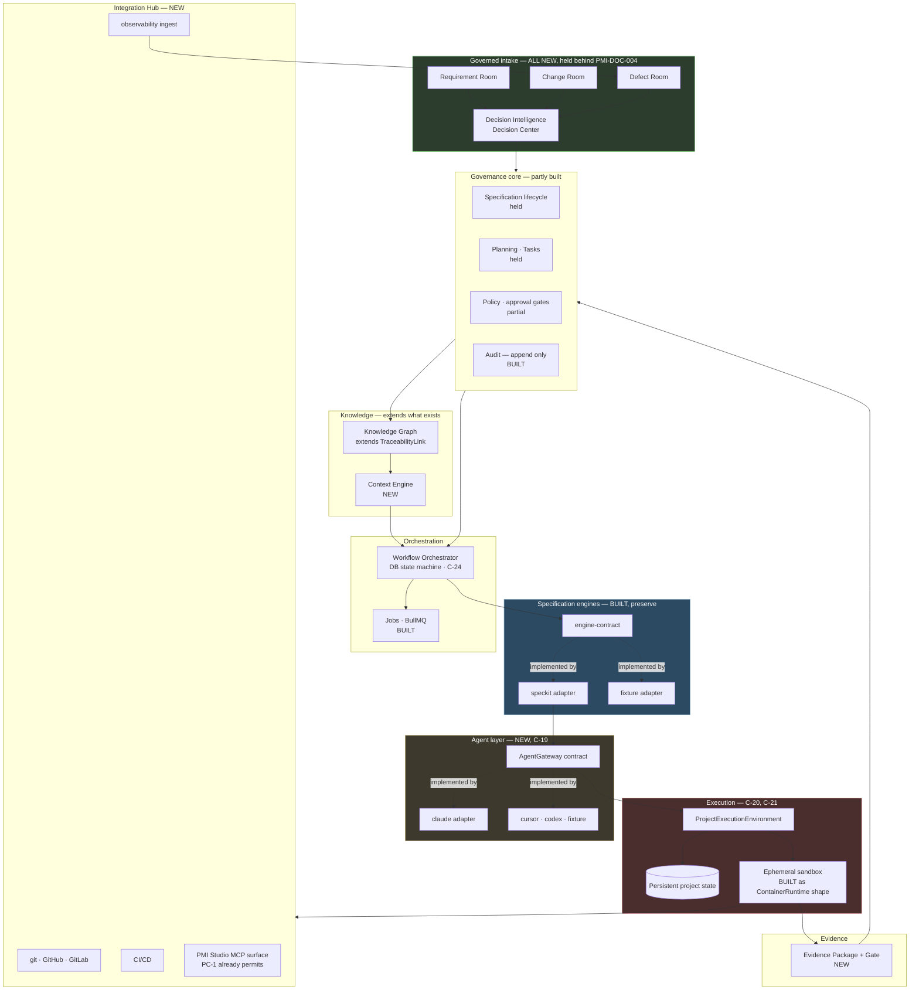

# AI-Native Target Architecture

**Scope**: platform-wide | **Date**: 2026-08-13 | **Status**: reassessment adopted by decision

Companion to [system-design.md](./system-design.md) and [tech-stack.md](./tech-stack.md). Those two
describe the platform **as built**. This one describes the target the four `SRS/August112026/`
amendment documents move it toward, and — more usefully — the precise distance between them.

Produced by the `EPIC-027` reassessment of 2026-08-13 and relocated here on the same day, because
programme-wide architecture that lives inside one epic's plan is a **PP-002 Single Source of Truth**
violation waiting to happen. `EPIC-027` cites this document; it does not own it.

**Decisions recorded here are recorded in full in** [`srs-alignment.md`](../srs-alignment.md)
**Part 8** (`C-19`–`C-26`, `D-20`–`D-41`). Where this document and that register disagree, the
register wins — it is the decision record; this is the design that follows from it.

**What this document does not do**: it designs nothing that is held behind `PMI-DOC-004`. Thirteen of
the seventeen capability areas the amendment introduces are product surface and stay held. The four
that proceed are architectural and are described below in the detail their imminence warrants.

---

# Part A — Architecture reassessment

## A.1 What exists, stated precisely

Only the engine lane is built. Verified by inspection, not by reading `tasks.md`:

| Component | State | Evidence |
|---|---|---|
| `packages/engine-contract` | ✅ built | `SpecificationEngine`: generate · generateTasks · validate |
| `engine-adapters/speckit` | ✅ built, **cannot run** | Logic complete and conformant; `ContainerRuntime` has no implementation (`T646`) |
| `engine-adapters/fixture` | ✅ built | Second engine proving contract neutrality |
| `backend/src/modules` | audit · engines · jobs **only** | No projects, requirements, specifications, traceability — all held |
| `worker/src` | ✅ built | `engine-composition.ts` (composition root), `generation.consumer.ts` |
| Architecture tests | 2 of 3 | `engine-independence.spec.ts`, `transport-independence.spec.ts`. **No agent-independence test exists** |
| Prisma | ❌ not a dependency yet | EPIC-004 `T013`. `EngineRegistration` verified by text assertion only |
| Product surface | ⏸ held | 19 epics pending `PMI-DOC-004` |

**The platform cannot currently run a real generation.** That is not a criticism — it is the state
the amendment lands on, and it changes which corrections are cheap.

## A.2 The amendment's target, mapped onto it

```text
  AMENDMENT TARGET                     TODAY                        VERDICT
─────────────────────────────────────────────────────────────────────────────────────
  Requirement / Change / Defect Rooms  ✗ zero occurrences           MISSING (build, not enhance)
  Decision Intelligence Engine         ✗ absent                     MISSING
  Engineering Context Engine           ✗ absent                     MISSING
  Knowledge Graph                      ◐ TraceabilityLink, 2 edges  ENHANCE  (EPIC-011/022)
  Evidence Package / Evidence Gate     ✗ absent                     MISSING
  Engineering Integration Hub          ✗ absent                     MISSING
  AI Agent Gateway                     ✗ absent — provider hardcoded CONFLICT (see A.3)
  ProjectExecutionEnvironment          ◐ ContainerRuntime port only  ENHANCE, urgently (A.4)
  Persistent project state             ✗ workspace destroyed by design MISSING (A.5)
  EgressPolicy abstraction             ◐ fixed allow-list, tested    CONFLICT (A.6)
  Spec Kit native to the workflow      ◐ CLI in a disposable sandbox ENHANCE (A.7)
  Source-of-truth boundaries           ◐ implicit, undocumented      CONFLICT (A.7)
  ExecutionJob / AgentRun, 10 states   ◐ GenerationJob, fewer states ENHANCE (A.8)
  MCP surface                          ✗ deferred to M-09 Phase 3    PHASE CONFLICT (A.9)
  Human / AI responsibility split      ◐ PP-003, no mechanism        ENHANCE
  SpecificationEngine contract         ✅ built                      PRESERVE (Native §28)
  Engine independence enforcement      ✅ build-time                  PRESERVE, and **replicate for agents**
```

## A.3 · **C-19 — Engine independence is enforced; agent independence is not** 🔴 CRITICAL

The amendment's most-repeated architectural rule (Native §2, §3; Plan Amendment §6) is that PMI
Studio must not depend on a single AI provider. The repository enforces the *analogous* rule for
engines with real teeth — and has no equivalent for agents.

**Evidence, from the tree:**

| Location | Content |
|---|---|
| `speckit.adapter.ts:133,144,172` | `'claude'` passed to `specify init --integration` |
| `speckit.adapter.ts:178` | `['claude', '-p', '/speckit-tasks']` |
| `speckit.adapter.ts:201` | `['claude', '-p', '/speckit-analyze']` |
| `speckit.adapter.ts:83` | `aiProviderToken: string` — one credential, one provider, no selection |
| `backend/tests/architecture/` | `engine-independence`, `transport-independence`. **No `agent-independence`** |

**Why this is a conflict and not merely a gap.** Under today's rules this code is compliant: the
adapter is allowed to be Spec-Kit-specific, and `backend/**` is clean. But the amendment adds a
second independence axis, and on that axis the *engine adapter is also the agent adapter*. Native §3
states the separation as a prohibition — *"Do NOT merge SpecificationEngine and AgentExecutor"* —
and gives the configurations that must become possible: `SpecKitEngine → Cursor`,
`NativePMIEngine → Claude`. Neither is expressible today without editing `speckit.adapter.ts`.

**The correction is cheap now and expensive later**, for the same reason ADR-0001 was worth taking
early: the adapter is one file, has 65 tests, and no product surface depends on it.

**Recommended correction** — three moves, all additive:

1. Introduce `packages/agent-contract` with an `AgentGateway` port (drafted in
   [contracts/agent-gateway.md](../027-ai-native-amendment/contracts/agent-gateway.md)).
2. Inject the agent into `SpecKitEngine` rather than naming it — the same composition-root pattern
   the worker already uses for engines. `--integration <agent.specKitIntegrationName>`.
3. Add `backend/tests/architecture/agent-independence.spec.ts`, the third test in the family, so the
   rule fails a build rather than relying on discipline. **This is the mechanism ADR-0001 proved
   works, applied to the axis the amendment cares about.**

**Cost**: one new package, one adapter refactor, ~3 tasks plus checks. **Owner decision `D-20`.**

## A.4 · **C-20 — `T646` is about to hard-code the execution substrate** 🔴 CRITICAL, time-sensitive

`ContainerRuntime` (`speckit.adapter.ts:66`) is `start(...)` / `stop(...)` with a workspace path, a
timeout and an abort signal. It has **no implementation**. The EPIC-003 closure report names `T646`
— write the production `ContainerRuntime` — as the single recommended next task, and it is right
that it is the last unexecuted claim in "Spec Kit is Engine V1".

Native §4 says: *"PMI Studio business logic must not depend directly on Docker … Define a
ProjectExecutionEnvironment abstraction capable of supporting persistent VM, persistent development
container, ephemeral container, Kubernetes workload, cloud development environment, future execution
providers."* It also says *"Docker remains the Phase 1 execution provider."*

**Both are satisfiable at once, but only if `T646` is written as a `ProjectExecutionEnvironment`
driver rather than as a Docker runtime.** The port is small and already correctly shaped; what it
lacks is the vocabulary the amendment needs — lifecycle (ephemeral vs persistent), an egress policy,
credential scoping, and a capability descriptor.

**If `T646` lands first as plain Docker, this becomes a refactor of the one component nobody can
test without Docker.** That is the argument for deciding now.

**Recommended correction**: widen the port to `ProjectExecutionEnvironment` (drafted in
[contracts/project-execution-environment.md](../027-ai-native-amendment/contracts/project-execution-environment.md)) and
implement `T646` against it with a Docker provider. Docker stays Phase 1; the seam is present from
the first implementation instead of retrofitted. **Cost: roughly +1 task over the plain
implementation.** **Owner decision `D-21` — the most urgent in this document.**

## A.5 · **C-21 — Persistent project state has no home**

Today's design is emphatic in the other direction, and for good reasons that still hold:

> *"Workspace never committed to any repository … One container per job, destroyed after … No state
> leaks between jobs or tenants."* — `_shared/system-design.md`

Native §5 requires **both**: durable engineering state (git repo, `.specify/`, `specs/`, agent and
build configuration) *and* ephemeral sandboxes that are created, used, and destroyed. §5 also states
the invariant that keeps them safe: *"No sandbox state may implicitly become authoritative project
state."*

This is **additive, not contradictory** — the ephemeral tier is preserved exactly as built; a
persistent tier is added beneath it. But it is genuinely new storage with genuinely new questions:
where does the persistent project live (a git remote? a volume? a cloud workspace?), who can reach
it, and how is it reconciled when two runs touch it. **Owner decision `D-22`; research `R-AI-007`,
`R-AI-010`.**

## A.6 · **C-22 — The egress allow-list conflicts with implementation agents** 🟠 HIGH

| Source | Position |
|---|---|
| `ADR-0002`, `system-design.md`, sandbox tests | Egress allow-list: **AI provider endpoint only** — *"Agent cannot reach the platform, the database, or the internet"* |
| Native §19 | *"Re-evaluate the existing 'AI provider endpoint only' egress policy because future implementation agents may require controlled access to approved MCP servers, package registries, repository endpoints, Context7/documentation services"* — and then, immediately: *"Do NOT simply open general internet access."* |

The current policy is correct **for generation** — a spec-writing agent needs nothing but the model.
It is impossible **for implementation** — an agent that cannot reach npm cannot run a build, and one
that cannot reach the repository cannot open a pull request.

**Recommended correction**: an `EgressPolicy` abstraction with **named profiles per execution
purpose**, not one widened list. `generation` keeps today's policy unchanged and its test unchanged;
`implementation` is a new, explicitly enumerated profile. This preserves ADR-0002 for the case it
was written for and extends rather than supersedes it — which is what Native §27 asks for.
**Owner decision `D-28`; research `R-AI-009`.**

## A.7 · **C-23 — Two sources of truth, structurally**

The deepest design question in the amendment, and it is easy to miss because both halves look
reasonable in isolation.

Today: a specification lives in PostgreSQL (`specifications` + `specification_versions`, raw and
parsed, append-only). Spec Kit markdown is produced inside a sandbox and **destroyed**. There is
exactly one authority.

Under the amendment: Spec Kit becomes native (§8), the project holds a persistent `specs/` tree
(§4), and agents read and write it. The same specification now exists as a database row **and** as a
tracked markdown file that git versions independently. Native §6 names the hazard in its own words:
*"Avoid two uncontrolled sources of truth between PostgreSQL and repository Markdown."*

§22 proposes the boundary — Postgres authoritative for governance state, git for implementation
history, Spec Kit files as *"engine-compatible representations"*, agent workspace and AI conversation
**not** authoritative — and then says *"Identify synchronization and conflict-resolution rules."*
Those rules do not exist, and they are not derivable from the documents.

**This is the one place where getting it wrong is unrecoverable**, because both stores accumulate
history that later has to be reconciled. **Owner decision `D-29`; research `R-AI-006`, `R-027-2`.**

## A.8 · **C-24 — Human-approval states do not belong in a job queue**

Native §20 asks whether `GenerationJob` should become `ExecutionJob`/`AgentRun` and lists ten states
— including `waiting_for_input` and `waiting_for_approval`.

BullMQ is the right tool for the other eight. It is the wrong tool for those two: a job that is
"running" for three days while a product owner is on leave holds a worker slot, defeats timeout
semantics, and makes the `timed_out` state meaningless. Native §20 anticipates the trap — *"Do not
add states without defining transition ownership and recovery semantics."*

**Recommended shape**: keep BullMQ for compute and make the run's lifecycle a **database-owned state
machine** that the queue serves. A run *suspends* — its queue job completes, its persisted state
becomes `waiting_for_approval`, and the approval event enqueues a fresh job to resume. Timeouts then
apply per compute segment, which is the only place they mean anything.

This preserves Native §28's BullMQ commitment while making the human-gate states honest. The
alternative — a durable-workflow engine such as Temporal — is a much larger change and is recorded
as the rejected option with its trigger. **Owner decision `D-25`; research `R-027-3`.**

## A.9 · **C-25 — MCP moves from marketplace to core agent enablement**

`C-07` was resolved by deferral: MCP is a *presentation layer* over existing services, deferred to
catalog module **M-09 MCP Marketplace**, Phase 3. The deferral was accepted **on condition** that
adding MCP later would not be a redesign — which is why `PC-1` exists and is tested.

The amendment changes what MCP is *for*. In Native §10 and §11, MCP is how an agent reaches governed
context under least privilege — `getRequirement`, `getAllowedContext`, `submitTestEvidence`,
`reportDefect`. That is not a marketplace feature. It is the agent's access path, and an agent
without it falls back to the thing §9 forbids: depending only on repository source code.

**`PC-1` was the right bet and it holds** — the services are transport-independent and the
architecture test proves it. What changes is *phase*, not design. **Owner decision `D-26`.**

---

# Part B — Technology reassessment

## B.1 The stack, re-examined against the amendment

Native §28 preserves sixteen elements. I re-tested each against the amendment's demands rather than
accepting the preservation clause at face value, because a preserved element that cannot carry the
new load is a worse outcome than an argued replacement.

| Element | Amendment load | Verdict |
|---|---|---|
| TypeScript 5.x / Node 22 | Agent contract, PEE contract — both compile-time interfaces | ✅ **Strengthened.** The reason TS was chosen (contracts that fail to compile) applies twice more |
| NestJS | DI composition root for a second adapter family | ✅ **Holds.** Agent adapters register exactly as engine adapters do |
| PostgreSQL 16 | Knowledge graph, evidence, decisions, 12-state machines | ⚠️ **Holds with a threshold** — see B.2 |
| Prisma | More entities, more migrations | ⚠️ **Holds, but is not yet installed** (`T013`). Every new entity below is currently unvalidated |
| BullMQ + Redis/Valkey | Agent runs, human-gate states | ⚠️ **Holds for compute; must not own human gates** — C-24 |
| React 18 | Decision Center, three Rooms, Kanban | ✅ Holds. No component library still chosen (awaits SRS Volume 8) |
| Docker | One of six execution substrates | ⚠️ **Holds as a provider; must stop being the abstraction** — C-20 |
| SpecificationEngine contract | Unchanged | ✅ **Preserve verbatim.** Native §3 protects it |
| Engine adapters + fixture | Pattern replicated for agents | ✅ **The template.** Its fixture adapter is why the conformance suite found three real defects |
| Worker composition root | Second adapter family injected here | ✅ Holds |
| Append-only audit | Evidence packages, decision history | ✅ **Exactly right.** Native §11 and lifecycle §8 both want immutability |
| Traceability model | 2 edge types → ~18 node types, bidirectional | ⚠️ **Extends** — EPIC-011 `T077a` asserts the two-type enumeration and will fail; EPIC-022 `T302` already exists to update it. **Scheduled, not discovered** |
| Architecture dependency tests | Third axis needed | ⚠️ **Extend** — C-19 |
| OpenTelemetry | Agent runs, correlation into sandboxes | ✅ Holds. PC-3's asymmetry (telemetry recorded *by the worker*, not the container) becomes more valuable, not less |
| Workspace identity | Tenancy above workspace already added by EPIC-019 F-17.1 | ✅ Holds |
| Asynchronous generation | Generalises to agent runs | ✅ Holds |

**No preserved element requires replacement.** Three require extension, and one (Docker) requires
demotion from *abstraction* to *provider*. That is a genuinely good outcome and worth stating: the
2026-08-02 stack decisions have survived a significant strategic amendment intact.

## B.2 Four technology decisions the amendment forces

These are not in the existing corpus. Each is recommended, none is adopted.

### B.2.1 Semantic search — `pgvector` 🟢 recommended

Three amendment capabilities require similarity, not exact match:

| Capability | Source |
|---|---|
| *"Find duplicate/overlapping requirements"* | lifecycle §1 |
| *"DEF-431 appears 94% similar to DEF-389"*; root-cause clustering | defect §9 |
| *"task-specific context rather than indiscriminately sending all available information to an LLM"* | Plan Amendment §9 |

Nothing in the stack does this. **`pgvector` is the minimal answer**: a PostgreSQL extension, no new
service, no new operational surface, and it keeps embeddings inside the same transactional store as
the governance state they describe — which matters because a stale embedding of a retired
requirement is a governance defect, not a cache miss.

**Rejected**: a dedicated vector database (Pinecone, Weaviate, Qdrant) — better at scale, but adds a
service and a consistency boundary to a product explicitly targeted at organisations *without*
platform teams (§1). Revisit if corpus size makes recall unacceptable; trigger recorded in
`R-027-5`. **Decision `D-24`.**

### B.2.2 Execution substrate — Docker now, behind `ProjectExecutionEnvironment` 🟢 recommended

Options assessed: Docker · Kubernetes Jobs · Firecracker/gVisor · cloud dev environments
(Codespaces, Coder, Daytona) · agent-sandbox services (E2B, Modal).

**Recommendation: keep Docker as the Phase 1 provider — Native §4 says so explicitly — and spend the
effort on the abstraction instead.** The substrate choice is genuinely reversible once the port
exists, and irreversible-in-practice if it does not. This is C-20 restated as a technology decision.

Worth noting under the amendment's own §2 test: an agent-sandbox service is *commodity execution*,
and buying it would be consistent with the principle. It is rejected for Phase 1 only because the
isolation contract (`ADR-0002`) is already built and tested, not because building it is right.
**Decision `D-21`.**

### B.2.3 Secrets and credential delegation 🟠 gap, no incumbent

The current position — *"Secrets management is an environment concern, not a Phase 1 requirement"* —
does not survive the amendment. Native §8 requires organisation-managed credentials, BYOK, provider
API credentials and enterprise gateways; §19 requires *scoped* repository credentials inside an
untrusted sandbox; §11 forbids the agent receiving organisation secrets at all.

Today the sandbox receives exactly one secret (`aiProviderToken`) and holds no repository
credential, because it never pushes. The moment an agent opens a pull request, that changes.

**This is the largest new security surface in the amendment** and it has no incumbent technology.
Options: cloud KMS/secret manager · HashiCorp Vault · short-lived tokens minted per run (GitHub App
installation tokens are the model). **Recommendation: per-run minted, purpose-scoped, short-lived
credentials — never long-lived secrets mounted into a sandbox** — with the broker abstracted so the
backing store is an operational choice. **Decision `D-27`; research `R-AI-011`.**

### B.2.4 AI Gateway — build or integrate? 🔵 the reflexive question

The amendment's own principle (§2) says: *own the workflow, governance, orchestration, traceability,
context and evidence; integrate commodity execution where mature external tools exist.*

Applied to itself, that principle asks an uncomfortable question. A multi-provider LLM gateway —
routing, failover, capability negotiation, cost metadata — is **not** PMI Studio's differentiator.
Mature options exist (LiteLLM, OpenRouter, Portkey, Bedrock, Vertex). By the amendment's own test,
the *gateway* is arguably commodity while the *orchestrator above it* is native.

But Native §7 wants agent descriptors carrying MCP support, repository capabilities, security
classification and interactive/unattended support — properties no LLM gateway models, because they
describe **coding agents**, not models. Claude Code, Cursor and Codex are not interchangeable model
endpoints.

**Recommendation: split the layer.** `AgentGateway` (agent-level: capability negotiation, execution,
evidence) is **native** — nothing off the shelf models it. Model-level routing beneath it is
**integrable**, and the contract should not prevent an adapter from delegating to LiteLLM or
Bedrock. This is the amendment's §2 classification applied honestly rather than defensively.
**Decision `D-30`.**

## B.3 · **C-26 — Positioning implies a hosting decision the corpus refuses to make** 🟠 HIGH

`_shared/system-design.md` records, deliberately: *"Hosting substrate — containers imply nothing
about where they run. No Phase 1 requirement depends on it."* That was true and well-judged.

Plan Amendment §1 changes it. The target market is *"small and medium software companies, startups,
agencies … organizations without dedicated internal developer-platform teams"*, and §15 promises
*"the engineering capabilities of a sophisticated internal developer platform without having to
design, integrate, secure and maintain one themselves."*

An organisation without a platform team cannot operate a Postgres cluster, a Redis, a worker fleet
and a Docker sandbox host. **The positioning implies multi-tenant SaaS**, and that decision changes
credential architecture (§8 BYOK), egress policy (§19), tenancy enforcement, and the cost model
(PP-017, RAID R-02) — all four of which are otherwise being decided in this same pass.

The corpus does not decide it, and it is not derivable from the amendment. **Decision `D-31` — the
most consequential business-architecture question raised by this reconciliation.**

---

# Part C — System design: the target seams

## C.1 Target architecture, with today's boundaries marked



**Read the colours as cost.** Blue is built and preserved. Amber is the one new contract that must
land early because the built code already violates it. Red is the execution seam whose next task is
imminent. Green is everything held behind the BRS — and it is most of the amendment.

## C.2 The four dependency rules, extended

The existing rule set gains three lines. They are the whole of C-19 and C-20 expressed as something
a build can fail on:

```text
backend    ──►  packages/engine-contract         ✅   (existing)
backend    ──►  engine-adapters/*                ❌   (existing, tested)
worker     ──►  engine-adapters/*                ✅   composition root only (existing)
service    ──►  HTTP types                       ❌   PC-1 (existing, tested)

engine adapter ──►  agent-contract               ✅   ENFORCED — engines request an agent
engine adapter ──►  a named provider             ❌   ENFORCED — no 'claude' string outside an agent adapter
any component  ──►  a container runtime directly ❌   ENFORCED — only via ProjectExecutionEnvironment
execution-contract ──► agent-contract            ❌   ENFORCED — layering; the environment knows nothing of agents
```

Each of the new rules is one assertion in `agent-independence.spec.ts`. That file is the
smallest artifact in this plan and the one that does the most work, because it converts the
amendment's most repeated instruction from prose into a build failure.

> **Marked ENFORCED 2026-08-17 by `T590`.** All four assertions are live in
> `backend/tests/architecture/agent-independence.spec.ts` and run in CI as `pnpm test:arch`, which
> is a build-failing gate rather than a review convention. The fourth rule — the layering
> assertion — was added by the analyse pass of 2026-08-14: [plan.md](../028-agent-execution-seam/plan.md)'s
> build order rests on *"the agent contract references `ExecutionSession`, never the other way
> round"*, and nothing enforced it. A claim the build order depends on should fail a build.
>
> **No conformance check reads this paragraph, deliberately.** Constitution V covers document
> outputs, but **no `specs/_shared/*.md` in this corpus has one** — EPIC-018's governance suite
> covers `governance/**` only. Adding a check here for a single paragraph would create a standard
> that seven sibling documents immediately fail. Recorded as a **corpus-wide gap** belonging to an
> EPIC-018 follow-up alongside `D-39`, rather than fixed locally in a way that looks like coverage
> and is not.

## C.3 What this epic does **not** design

Stated so nobody assumes oversight:

- **The three Rooms' internal design.** Held behind the BRS, and the BRS is exactly the document
  that should settle requirement-approval behaviour.
- **The Knowledge Graph's physical schema.** EPIC-011/EPIC-022 own the link model; this epic records
  the node-type expansion as a classification and a threshold, not a migration.
- **The MCP tool list.** Native §10 lists 19 candidates and says *"exact tools must be specified
  during design"*. That is M-09's work.
- **Model selection and cost optimisation.** Still deferred to M-07 (PP-017). RAID **R-02** must be
  re-scored — autonomous multi-agent execution raises the exposure materially, and this is the
  second epic to say so (EPIC-017 said it first).

---

## Reconciliation outcome — EPIC-027, 2026-08-17

This document records the *target seams*. The **reconciliation** that classified the amendment against
the corpus is EPIC-027, and its outputs are linked rather than restated here (PP-002):

| Artifact | What it holds |
|---|---|
| [`impact-report.md`](../027-ai-native-amendment/impact-report.md) | The §18 twenty-five-section report, ending in the three-band sequence |
| [`register/clauses.md`](../027-ai-native-amendment/register/clauses.md) | 599 clauses from five documents, one row each |
| [`register/verdicts.md`](../027-ai-native-amendment/register/verdicts.md) | One verdict per clause, with owner and reasoning |
| [`register/capability-areas.md`](../027-ai-native-amendment/register/capability-areas.md) | The twenty areas, each with a verdict, a home and a posture |
| [`register/premises.md`](../027-ai-native-amendment/register/premises.md) | Finding A's evidence — the searches, counts and locations |
| [`adr/`](../../adr/) | `ADR-0006`–`ADR-0022`, the seventeen subjects Native §27 and Cosmos §9 name |

**Three findings bear directly on the architecture above**: three of the four proceeding capability
areas are now BUILT by EPIC-028; three capability areas have **no owning epic** (Governed Engineering
Loops, Governed Learning, Specification Compliance Agent); and four decided components have **no home**
(SaaS substrate, egress proxy, credential broker, BYOK).
