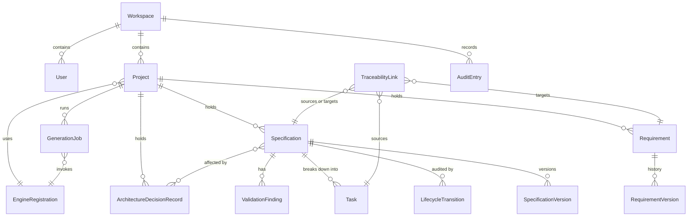

# Phase 1 Data Model: PMI Studio Phase 1 Platform Core

**Epic**: `EPIC-001` | **Date**: 2026-08-02 | **Plan**: [plan.md](./plan.md)

Entities derived from the specification's Key Entities, with fields, relationships, validation rules,
and state transitions. Every rule cites the requirement it implements.

## Universal rules

These apply to **every** entity below and are enforced once, centrally, not per module.

| Rule | Requirement |
|------|-------------|
| Every row carries `workspace_id`, set on insert and never updated | FR-002 |
| Every query is filtered by the acting user's workspace; a missing filter is a defect, not a preference | FR-002, SC-004 |
| Every row carries `created_at`, `created_by`, `updated_at`, `updated_by` | FR-014, FR-033 |
| Identifiers are opaque, non-sequential, and unique across the corpus | FR-005 |
| Deletion is soft wherever an artifact can be traced from | FR-006 |
| Every state-changing write emits an audit entry in the same transaction | FR-033, SC-012 |

---

## Workspace

The tenancy boundary. Present from the first migration so Phase 3 multi-tenancy needs no data
migration (clarification: multi-tenant-ready, single-user surface).

| Field | Type | Rules |
|-------|------|-------|
| `id` | id | |
| `name` | text | Required, 1–200 chars |
| `owner_user_id` | ref → User | Required |

**Relationships**: has many Users, Projects, Storage-scoped settings.

---

## User

| Field | Type | Rules |
|-------|------|-------|
| `id` | id | |
| `email` | text | Required, unique, valid address |
| `display_name` | text | Required |
| `password_hash` | text | Argon2id (R-008). Never returned by any read path |
| `workspace_id` | ref → Workspace | Required |

---

## Project

| Field | Type | Rules |
|-------|------|-------|
| `id` | id | |
| `name` | text | Required, 1–200 chars, unique within workspace |
| `description` | text | Optional |
| `status` | enum | `active` \| `archived`. Default `active` (FR-001) |
| `engine_id` | ref → EngineRegistration | Required; defaults to the registered default engine (FR-019) |
| `owner_user_id` | ref → User | Required |

**Relationships**: has many Requirements, Specifications, ArchitectureDecisionRecords.

**Rules**: archiving never deletes content (FR-001, US1 scenario 5). All project content is scoped to
its project with no cross-project reachability (FR-003).

---

## Requirement

The head of the traceability chain.

| Field | Type | Rules |
|-------|------|-------|
| `id` | id | |
| `project_id` | ref → Project | Required |
| `reference` | text | Human-facing identifier, unique within project (FR-005) |
| `description` | text | **Required, non-empty** — save refused with the missing field named (FR-007) |
| `type` | enum | `business` \| `functional` \| `non_functional` \| `constraint` (FR-005) |
| `priority` | enum | `p1` \| `p2` \| `p3` (FR-005) |
| `status` | enum | `active` \| `retired`. Default `active` |
| `content_hash` | text | Detects material change for FR-032 out-of-date flagging |

**State transitions**: `active → retired` only. Retired requirements are **never deleted** — anything
generated from them stays traceable (FR-006, US7 scenario 4).

**Relationships**: has many RequirementVersions; linked to Specifications via TraceabilityLink.

**Indexes**: `(project_id, type)`, `(project_id, priority)`, `(project_id, status)` — FR-008 filtering.

---

## RequirementVersion

Edit history (FR-009).

| Field | Type | Rules |
|-------|------|-------|
| `id` | id | |
| `requirement_id` | ref → Requirement | Required |
| `description` | text | The text as it stood |
| `type`, `priority` | enum | As they stood |
| `authored_by` | ref → User | Required |
| `authored_at` | timestamp | Required |

**Rules**: append-only. Previous text remains retrievable after any edit (US2 scenario 2).

---

## Specification

| Field | Type | Rules |
|-------|------|-------|
| `id` | id | |
| `project_id` | ref → Project | Required (FR-010 — belongs to exactly one project) |
| `title` | text | Required |
| `current_version_id` | ref → SpecificationVersion | Required |
| `lifecycle_state` | enum | `draft` \| `review` \| `approved` \| `baselined` \| `implemented` \| `archived` (FR-011, SRS M08 §8) |
| `engine_id` | ref → EngineRegistration | Required (FR-022) |
| `engine_version` | text | Required. Captures **both** Spec Kit version and AI agent/model identity — the same Spec Kit with a different model is a different engine version (R-001) |
| `generated_at` | timestamp | Required (FR-022) |
| `is_out_of_date` | boolean | Set when a source requirement changes; never auto-corrected (FR-032) |

**State transitions** (FR-011, per SRS module spec **M08 §8**) — anything else is refused with the
permitted set named:

```text
draft ──► review ──► approved ──► baselined ──► implemented ──► archived
  ▲          │                        │              │              ▲
  └──────────┘                        └──────────────┴──────────────┘
```

- `review → draft` is permitted (rejection returns it for rework).
- `approved → draft` is **not** permitted (US5 scenario 4).
- **`baselined` is immutable** (FR-011a): editing a baselined specification creates a new version in
  `draft`; the baselined version remains retrievable unchanged.
- `approved`, `baselined`, and `implemented` may all be **archived** (FR-011b). Archiving retains
  the specification and its traceability links — it is not deletion.

Editing an approved specification creates a new version and leaves the approved version retrievable
unchanged (FR-013, US5 scenario 2).

**Rules**: task generation requires `approved` (FR-020, US4 scenario 2). Every specification links to
≥1 originating Requirement — zero orphans (FR-029, SC-002).

---

## SpecificationVersion

Immutable snapshot (FR-013).

| Field | Type | Rules |
|-------|------|-------|
| `id` | id | |
| `specification_id` | ref → Specification | Required |
| `version_number` | integer | Monotonic per specification, from 1 |
| `content_raw` | text | The engine's original output, stored verbatim (R-007) |
| `content_parsed` | json | Structure extracted from `content_raw` |
| `lifecycle_state_at_creation` | enum | |
| `authored_by` | ref → User | Required (FR-014) |
| `authored_at` | timestamp | Required (FR-014) |

**Rules**: **append-only — never updated, never deleted** (FR-013, SC-007). Storing raw alongside
parsed means a future parser fix can re-derive structure without re-running the engine (R-007).
Any two versions of the same specification are comparable (FR-015).

---

## LifecycleTransition

| Field | Type | Rules |
|-------|------|-------|
| `id` | id | |
| `specification_id` | ref → Specification | Required |
| `from_state`, `to_state` | enum | Required |
| `actor_id` | ref → User | Required (FR-014) |
| `occurred_at` | timestamp | Required (FR-014) |

---

## Task

| Field | Type | Rules |
|-------|------|-------|
| `id` | id | |
| `specification_id` | ref → Specification | Required |
| `description` | text | Required |
| `status` | enum | `not_started` \| `in_progress` \| `done` (spec Assumptions — richer states arrive with the Phase 2 workflow engine) |
| `engine_id`, `engine_version` | ref, text | Required (FR-022) |

**Rules**: every task resolves back through its specification to ≥1 requirement (FR-029, SC-003).
Regeneration warns about the effect on existing tasks before replacing anything (US4 scenario 4).

---

## EngineRegistration

| Field | Type | Rules |
|-------|------|-------|
| `id` | id | |
| `name` | text | Required, unique |
| `version` | text | Required |
| `capabilities` | string[] | Must contain every Phase 1 required capability, else registration is refused naming the missing one (FR-021, US8 scenario 4) |
| `is_default` | boolean | Exactly one registration is default |

**Rules**: projects select an engine (FR-019). Adding an engine requires **no change outside the
adapter layer** — enforced by the architecture test in R-009 (SC-008).

---

## GenerationJob

One engine invocation. Its state machine is where FR-024 to FR-028 live.

| Field | Type | Rules |
|-------|------|-------|
| `id` | id | |
| `project_id` | ref → Project | Required |
| `job_key` | text | Idempotency key — a duplicate submission joins the existing job rather than starting a second (spec edge case) |
| `kind` | enum | `generate_specification` \| `generate_tasks` \| `validate_specification` |
| `requested_by` | ref → User | Required |
| `engine_id` | ref → EngineRegistration | Required |
| `input_refs` | json | Requirement or specification ids supplied to the engine |
| `state` | enum | See below |
| `failure_reason` | enum | See taxonomy below (FR-026) |
| `access_snapshot` | json | Grants in force at start (forward-compatible with EPIC-002) |
| `started_at`, `ended_at` | timestamp | |

**State transitions**:

```text
queued ──► running ──┬──► succeeded
                     ├──► failed
                     ├──► cancelled     (user action, FR-024)
                     └──► timed_out     (limit reached, FR-025)
```

**Failure taxonomy** (FR-026 — each must be distinguishable; a generic error is a defect, SC-005):

`engine_unavailable` · `engine_error` · `malformed_output` · `empty_output` · `timeout` ·
`cancelled` · `input_too_large` · `empty_selection`

**Rules**: any terminal state other than `succeeded` stores **no partial artifact** (FR-027, SC-006).
A running job never blocks other platform use (FR-028).

---

## TraceabilityLink

The graph that makes the artifacts a system (FR-029 to FR-031).

| Field | Type | Rules |
|-------|------|-------|
| `id` | id | |
| `source_type`, `source_id` | enum, id | Required |
| `target_type`, `target_id` | enum, id | Required |
| `relationship` | enum | `generated_from` \| `derived_from` |
| `created_at` | timestamp | Required |

**Permitted edges**: `Specification → Requirement` (`generated_from`), `Task → Specification`
(`generated_from`).

**Rules**: traversable in **both** directions (FR-030). Coverage gaps are derived from absence —
requirements with no specification, specifications with no tasks (FR-031, SC-010). Links to retired
requirements are retained and marked as such (US7 scenario 4).

**Indexes**: `(source_type, source_id)` and `(target_type, target_id)` — both traversal directions
must stay fast at 500 specifications per project (SC-009).

---

## ValidationFinding

| Field | Type | Rules |
|-------|------|-------|
| `id` | id | |
| `specification_id` | ref → Specification | Required |
| `specification_version_id` | ref → SpecificationVersion | Findings belong to the version validated |
| `location` | text | **Required** — must identify the part of the specification concerned (FR-023) |
| `severity` | enum | `info` \| `warning` \| `error` |
| `message` | text | Required |

**Rules**: outstanding findings are shown before approval proceeds (US6 scenario 3).

---

## ArchitectureDecisionRecord

Per the SRS: *"Maintain Architecture Decision Records from day one."*

| Field | Type | Rules |
|-------|------|-------|
| `id` | id | |
| `project_id` | ref → Project | Required |
| `reference` | text | e.g. `ADR-0001`, unique within project |
| `title` | text | Required |
| `status` | enum | `proposed` \| `accepted` \| `superseded` |
| `context`, `decision`, `consequences` | text | Required |

**Relationships**: many-to-many with Specification — decisions link to the specifications they
affect (FR-034).

---

## AuditEntry

| Field | Type | Rules |
|-------|------|-------|
| `id` | id | |
| `workspace_id` | ref → Workspace | Required |
| `actor_id` | ref → User | Nullable only for unauthenticated refusals |
| `action` | enum | `create` \| `update` \| `lifecycle_transition` \| `engine_invocation` \| `access_refused` |
| `target_type`, `target_id` | enum, id | Required |
| `outcome` | enum | `success` \| `refused` \| `failed` |
| `occurred_at` | timestamp | Required |

**Rules**: **immutable — no update or delete path exists** (FR-033). Written in the same transaction
as the action it records, so an action cannot succeed without its audit entry (SC-012).

---

## Entity relationship overview



## Coverage check

Every specification entity is represented. Two additions beyond the spec's list, both required by
the design rather than invented:

- **RequirementVersion** — FR-009 requires requirement edit history; the spec named it as an
  attribute rather than an entity, but it needs its own rows to be append-only.
- **LifecycleTransition** — FR-014 requires recording who transitioned a specification and when;
  storing only the current state cannot satisfy it.
