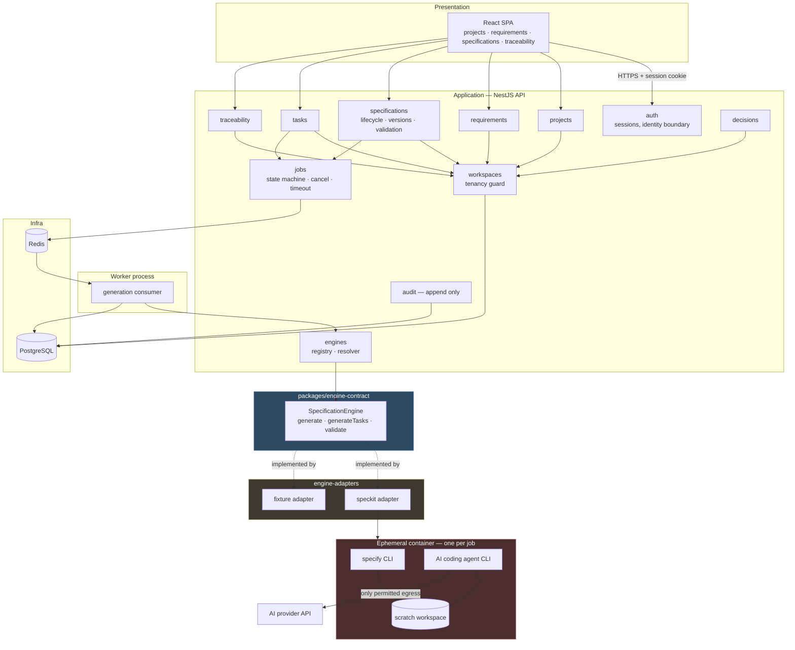
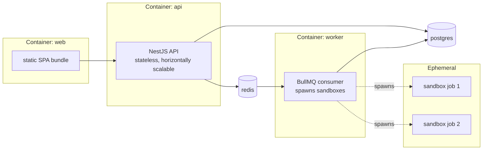
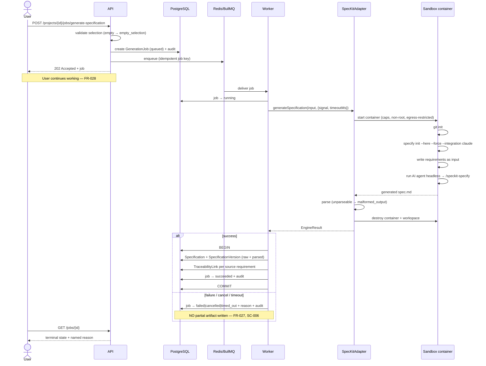

# System Design: PMI Studio Phase 1 Platform Core

**Epic**: `EPIC-001` | **Date**: 2026-08-02 | **Plan**: [plan.md](./plan.md)

Component architecture, runtime topology, and the flows that matter. Companion documents:
[tech-stack.md](./tech-stack.md), [dependencies.md](./dependencies.md), [schema.sql](./schema.sql),
[raid-log.md](./raid-log.md).

> **This document describes the platform as built.** For the target the `SRS/August112026/` amendment
> moves it toward — and the measured distance between the two — see
> [ai-native-architecture.md](./ai-native-architecture.md). Four decisions taken 2026-08-13 change
> statements below: `D-21` demotes Docker from abstraction to provider, `D-28` splits the egress
> allow-list into named profiles, `D-22` adds persistent project state alongside the ephemeral
> sandbox, and `D-31` commits the product to multi-tenant SaaS. Nothing here is wrong; it is
> incomplete as of that date.

## Design drivers

Four forces shape every decision below:

1. **Spec Kit is not a callable API** (research R-001). Generation means orchestrating an AI coding
   agent inside a disposable workspace. This is the dominant architectural constraint.
2. **Engine independence must be mechanically enforced** — the SRS's most emphasised decision, and
   worthless if it relies on discipline (research R-009).
3. **Multi-tenant-ready on a single-user surface** — workspace identity on every row from the first
   migration, so Phase 3 needs no data migration.
4. **Generation is untrusted execution** — an AI agent writing files and running commands cannot
   share a process with the platform.

## Layer mapping to the SRS

The SRS defines a layered architecture. Phase 1 implements the shaded portion:

| SRS layer | Phase 1 realisation | Status |
|---|---|---|
| Presentation | React SPA | ✅ Built |
| Application | NestJS modules (projects, requirements, specifications, tasks) | ✅ Built |
| Requirement Intelligence | — | ⛔ Phase 2 |
| Specification Management | `specifications` module: lifecycle, versions, validation | ✅ Built |
| Workflow Orchestrator | Minimal: generation job queue only | ◐ Partial |
| AI Platform | — | ⛔ Phase 2 |
| **Specification Engine Interface** | `packages/engine-contract` | ✅ Built |
| **Engine Adapters** | `engine-adapters/speckit`, `engine-adapters/fixture` | ✅ Built |
| Execution Layer | AI coding agent inside the engine sandbox | ✅ Built |
| Infrastructure | PostgreSQL, Redis, Docker | ✅ Built |

## Component architecture



**The two coloured boundaries are the load-bearing ones.** Nothing in the Application layer may
reference anything in Adapters — only the Contract. The Sandbox is a hard process and network
boundary, not a module boundary.

## Principle-derived design constraints

Decision **D-6** (2026-08-03) made PMI-DOC-003's principles binding on the programme, with per-Epic
deferrals recorded. Two deferrals in EPIC-001's register attach **constraints on this design**, not
merely a promise to build something later.

### PC-1 · Services must be callable without the REST layer *(PP-007, deferred to M-09)*

MCP is deferred to Phase 3, but the deferral was accepted **on condition** that adding an MCP
surface later is not a redesign. That imposes a rule now:

```text
Transport (REST controller | future MCP server)  ──►  Service        ✅
Service                                          ──►  Transport      ❌ FORBIDDEN
```

- Every capability lives in a **service** that takes plain arguments and returns plain results.
- Controllers are **transport adapters only** — parse, authorise, delegate, serialise. No business
  logic, no orchestration.
- A service must never touch an HTTP request, response, header, or status code.

**Why this matters**: MCP is a second transport over the same capabilities. If business logic leaks
into controllers, Phase 3 either duplicates it or refactors the whole application layer. The cost of
holding the line now is roughly zero; the cost of not holding it is a rewrite.

**Enforcement**: the same mechanism used for engine independence — an architecture test asserting no
file under `backend/src/modules/**/*.service.ts` imports an HTTP type. Build fails otherwise. This
is a natural extension of the existing `test:arch` suite (T047, T142) rather than new machinery.

### PC-2 · Cost containment is in scope; cost optimisation is not *(PP-017, deferred to M-07)*

The principle was split rather than deferred whole. **Containment ships in this Epic** — hard
wall-clock, CPU, and memory caps per sandboxed job (R-006, FR-025) bound spend even without
measuring it. **Optimisation** — model selection by quality, latency, and cost — belongs to the AI
Platform module and is meaningless in Phase 1, which runs a single model.

Design consequence: the engine descriptor already records **which model produced each artifact**
(FR-022, R-001). That is the data M-07 will need to do cost attribution retrospectively, so Phase 1
is not creating a blind spot it will have to backfill.

### PC-3 · Observability is first-class *(PP-010, adopted by decision D-7)*

All four signals PP-010 names are in scope: **logging, metrics, tracing, and auditability**. Audit
was already database-enforced; the other three are delivered by function **F-00.5** (T157–T164) using
OpenTelemetry with structured JSON logs (research R-011).

**One correlation identifier, four hops:**

```text
API edge          generate correlation_id ──► span, log context
   │
   ├─ BullMQ job payload  ──────────────────► carried, not regenerated
   │
   ├─ Worker              ──────────────────► child span, log context
   │
   └─ Sandbox container   ──────────────────► passed IN as an env var
                                              telemetry recorded BY THE WORKER, not the container
```

**The asymmetry is deliberate.** Passing an identifier *into* the sandbox costs nothing — an
environment variable requires no change to the security contract. Getting telemetry *out* would
require widening the egress allow-list, weakening ADR-0002 for marginal benefit. So the sandbox
emits nothing; the worker records the job's spans and metrics on its behalf, from outside.

This is precisely why D-7 was worth deciding **before** implementation. Retrofitting telemetry
across this boundary would mean reopening the sandbox contract.

**Two hard exclusions**, asserted by test (T157):

- **Engine output is never logged** — it may contain customer requirements
- **No credential is ever logged**, including in diagnostics

**Backend choice is deliberately absent**: the OpenTelemetry collector endpoint is configuration.
Choosing Datadog, Grafana, or anything else is an operational decision, not a Phase 1 one — and
keeping it out of application code serves PP-015.

## Dependency rule

```text
frontend  ──►  backend
backend   ──►  packages/engine-contract          ✅ permitted
backend   ──►  engine-adapters/*                 ❌ FORBIDDEN — build fails
worker    ──►  packages/engine-contract          ✅
worker    ──►  engine-adapters/*                 ✅ (composition root only)
adapters  ──►  packages/engine-contract          ✅
adapters  ──►  backend                           ❌ FORBIDDEN
controller ──►  service                          ✅ permitted
service   ──►  HTTP types                        ❌ FORBIDDEN — see PC-1
```

Enforced twice: an ESLint dependency-boundary rule (T008) catches it in the editor; the architecture
test (T047, T142) fails the build. Adapters are injected at the composition root in the worker, so
the API never holds a reference to a concrete engine.

The last two rules are new. They are what keeps PP-007's deferral honest: MCP is a second transport
over the same services, so business logic must never sit in a controller (PC-1).

## Runtime topology



The API is stateless — all state lives in PostgreSQL and Redis. The worker is the only component
permitted to spawn sandboxes, and the only one holding AI provider credentials.

## Key flow: generate a specification

The flow that defines the Epic. Note that **no step blocks the user**.



**Transaction boundary matters**: the specification, its version, its traceability links, and the
job's terminal state are written in **one** transaction. A crash mid-write leaves no orphan
specification, which is what makes SC-002 ("zero orphaned specifications") structurally true rather
than defended by cleanup jobs.

## Failure handling design

Every non-success terminal state produces a **named** reason (FR-026, SC-005). Generic errors are
treated as defects.

| Reason | Detected where | User sees |
|---|---|---|
| `empty_selection` | API, before enqueue | "Select at least one requirement" |
| `input_too_large` | Adapter, before container start | "Selection too large for the engine" |
| `engine_unavailable` | Adapter, container won't start | "The engine is unavailable" |
| `engine_error` | Adapter, agent exits non-zero | "Generation failed" + reason |
| `malformed_output` | Adapter, parser rejects | "The engine returned unusable output" |
| `empty_output` | Adapter, nothing produced | "The engine returned nothing" |
| `timeout` | Worker, wall-clock cap | "Generation exceeded its time limit" |
| `cancelled` | Worker, user action | "Cancelled" |

Two are caught **before** work starts (`empty_selection`, `input_too_large`) — the spec requires
oversized input to be rejected up front rather than after a failed run.

## Sandbox security design

| Control | Rationale |
|---|---|
| One container per job, destroyed after | No state leaks between jobs or tenants |
| Non-root user | Limits in-container escalation |
| Read-only root filesystem except the scratch workspace | Agent cannot modify its own tooling |
| CPU, memory, and wall-clock caps | Enforces FR-025; bounds runaway AI agent cost |
| Egress allow-list: AI provider endpoint only | Agent cannot reach the platform, the database, or the internet |
| No platform credentials mounted | Agent holds AI provider credentials only, never a DB or session secret |
| Workspace never committed to any repository | Prevents generated scaffolding being mistaken for platform code (Constitution I) |

**Threat being mitigated**: the AI agent executes arbitrary commands by design. Treating it as
trusted would make generation a remote code execution path into the platform.

## Data design principles

Full DDL in [schema.sql](./schema.sql); entity semantics in [data-model.md](./data-model.md).

- **Workspace on every row.** Not a filter applied at the query site — a scoping helper that every
  repository call goes through, so a missing filter is a compile-time or test failure.
- **Append-only where history is required**: `specification_versions`, `requirement_versions`,
  `lifecycle_transitions`, `audit_entries`. No update or delete path exists in code or grants.
- **Soft retirement, never deletion**, for anything traceable from (FR-006).
- **Raw plus parsed** engine output stored together, so a parser fix never means data loss.
- **Traceability as rows, not as a view** — indexed in both directions because both traversals are
  first-class (FR-030).

## Scalability position

Phase 1 targets correctness at moderate scale, not elasticity.

| Dimension | Phase 1 | Trigger to revisit |
|---|---|---|
| Specifications per project | ≥500 without degradation (SC-009) | Measured regression |
| Concurrent generation jobs | Bounded worker concurrency; excess queues | Queue wait becomes user-visible |
| API instances | Stateless, horizontally scalable | Load |
| Database | Single primary | Read load on traceability queries |

Deliberately deferred: worker autoscaling, read replicas, sharding. No Phase 1 requirement depends
on them, and RAID entry **R-07** tracks the cost exposure that would force the conversation.

## Extension seams for later phases

Designed in now because retrofitting them is expensive:

| Future need | Seam already present |
|---|---|
| Phase 3 RBAC / SSO | Identity-provider interface (R-008); `workspace_id` on every row |
| EPIC-002 access control | `access_snapshot` on `generation_jobs` |
| EPIC-002 unattended runs | Job state machine already supports queued/long-running work |
| Phase 4 native engine | The engine contract — the entire point of the adapter layer |
| Phase 2 workflow engine | Job orchestration exists; workflow sits above it |

## Design decisions deliberately NOT made

Recorded so nobody assumes they were overlooked:

- **Hosting substrate** — containers imply nothing about where they run. No Phase 1 requirement
  depends on it.
- **AI provider and model** — an engine image configuration concern, recorded per artifact (FR-022).
- **Observability tooling** — audit is specified and built; operational telemetry is an ops choice.
- **Accessibility standards** — **settled**: WCAG 2.2 AA (EPIC-010, 2026-08-19), carried into `PMI-DOC-005` §6.4 (approved 2026-08-20). Localisation remains unspecified and is not claimed by any Epic. *(Was: "arrives with SRS Volume 8" — never written, corrected by `D-41`.)*
